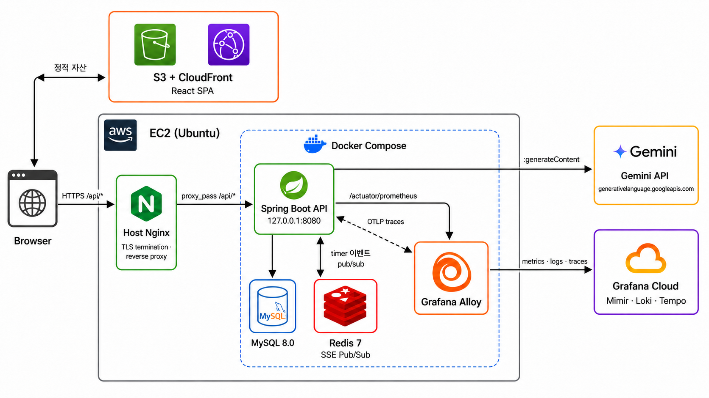

# FlowMate

Todo를 적는 순간부터 집중 세션을 실행하고, 타이머 기록을 회고까지 이어가는 생산성 웹 앱입니다.

할 일 관리와 집중 기록이 서로 분리될 때 생기는 전환을 줄이고, 하루와 주간 단위의 작업 흐름 그리고 회고까지 하나의 서비스 안에서 이어가는 데 초점을 맞췄습니다.

- [Live Demo](https://flowmate.io.kr): 실제 서비스 바로가기
- [Architecture](docs/architecture.md): 시스템 구조, 인증 흐름, SSE 동기화, 배포 구조
- [Data Model](docs/data-model.md): 핵심 엔터티, 관계, 물리 모델, 설계 근거
- [API Docs](docs/api.md): 인증, Todo, 타이머, 설정, 회고 API 계약



## 1. 프로젝트 배경

개인적으로 Todo 관리는 `TodoMate`, 집중 시간 관리는 `Flow`를 함께 사용해왔습니다.

하지만 두 앱을 번갈아 쓰다 보니 컨텍스트가 자주 끊기고, “할 일”과 “집중 기록”이 분리되는 점이 불편했습니다.

- `TodoMate`는 태스크 관리가 직관적이지만 뽀모도로 타이머가 없다.
- `Flow`는 집중 시간 측정에는 좋지만 태스크 기반 기록이 약하다.

FlowMate는 Todo를 중심으로 태스크와 집중 세션을 한 흐름에서 기록하고, 그 결과를 캘린더와 회고로 되돌아볼 수 있게 설계하였습니다.

## 2. 주요 기능

### 1) Todo와 집중 세션 연결

- 할 일을 작성한 뒤 바로 타이머를 시작할 수 있습니다.
- 완료한 세션 기록은 Todo와 연결되어 이후 회고와 통계로 이어집니다.

### 2) 뽀모도로와 스톱워치 지원

- 뽀모도로 모드로 집중, 짧은 휴식, 긴 휴식 사이클을 관리할 수 있습니다.
- 스톱워치 모드로 더 집중 기록도 남기고, 추천 휴식과 자유 휴식을 제공하여 유연하게 사용할 수 있습니다.

### 3) 여러 탭·기기 간 타이머 동기화

- 회원은 서버에 저장된 타이머 상태를 기준으로 여러 탭과 기기에서 이어서 사용할 수 있습니다.
- SSE 기반 동기화로 같은 계정의 연결에 최신 타이머 상태를 전파합니다.

### 4) 회고와 AI KPT 레포트

- 집중 시간 타임라인과 누적 통계를 확인할 수 있습니다.
- 일간·주간·월간 단위 회고를 작성하며 작업 흐름을 돌아볼 수 있습니다.
- Spring backend의 report 도메인이 Gemini API로 완료 Todo와 집중 기록 기반 KPT 회고 레포트를 생성합니다 (v1.11.0~).

## 3. 주요 기술 결정

### 1) X-Client-Id에서 OAuth + RTR까지 인증 시스템 발전시키기

- 문제: 초기 `X-Client-Id`는 서명도 TTL도 없는 브라우저 입력값으로, 사용자 신원 증명 불가
- 해결: 게스트 연속성과 회원 보안을 모두 만족하는 이중 인증 구조 — Guest JWT + Memory AT + HttpOnly RT + RTR
- 결과: 4단계 진화(X-Client-Id → Guest JWT → OAuth + RTR → Reuse Detection)를 거쳐 토큰 탈취 대응 구축
- 관련 문서: [X-Client-Id에서 OAuth + RTR까지 인증 시스템 발전시키기](docs/wiki/auth-evolution.md)

### 2) SSE로 멀티디바이스 타이머 동기화하기

- 문제: 타이머 상태가 Zustand + localStorage 기반이라, 같은 계정이어도 기기 간 상태 공유 불가
- 해결: 서버 → 클라이언트 단방향 push만 필요하므로 SSE + REST 조합으로 인프라 추가 없이 구현
- 결과: 타이머 조작이 모든 기기에 즉시 반영, version 단조 증가로 이벤트 역전 방지. k6 163K req 에러율 0%
- 관련 문서: [SSE로 멀티디바이스 타이머 동기화하기](docs/wiki/sse-sync.md)

### 3) Redis Pub/Sub으로 SSE 수평 확장하기

- 문제: SSE broadcast가 단일 JVM 메모리 기반이라, 인스턴스 2대 이상에서 cross-instance 이벤트 전파 불가
- 해결: 정본은 MySQL이므로 메시지 영속성은 불필요. Redis Pub/Sub at-most-once 전달로 인스턴스 간 전파
- 결과: 통합 테스트 → 로컬 2-JVM(도달률 0→100%) → 부하 30,000건 유실 0% → EC2 채널 실측, 4단계 검증
- 관련 문서: [Redis Pub/Sub으로 SSE 수평 확장하기](docs/wiki/redis-sse-pubsub.md)

### 4) Self-hosted 모니터링을 Alloy + Grafana Cloud로 전환하기

- 문제: Self-hosted Prometheus + Grafana + node-exporter 구조에서 로그·트레이스를 붙일수록 컨테이너와 설정 파일이 증가
- 해결: EC2에는 Alloy 수집기 1개만 두고, 메트릭·로그·트레이스를 Grafana Cloud(Mimir·Loki·Tempo)로 전송
- 결과: 모니터링 컨테이너 3→1개, 이후 확장은 `config.alloy` 변경으로 처리
- 관련 문서: [Self-hosted 모니터링을 Alloy + Grafana Cloud로 전환하기](docs/wiki/monitoring-stack.md)

## 4. 주요 트러블슈팅

### 1) 타이머 상태 저장의 동시성 제어: InnoDB Deadlock 분석과 해결

- 문제: k6 12VU 부하 테스트에서 timer PUT에 deadlock 69건 — first insert 시 gap lock과 insert intention lock 충돌
- 해결: `PESSIMISTIC_WRITE` 제거 + first insert 충돌을 catch-retry로 복구
- 결과: 요청 46% 증가(112K → 163K)에도 timer PUT 실패 0건, `http_req_failed` 0.00%
- 관련 문서: [타이머 상태 저장의 동시성 제어: InnoDB Deadlock 분석과 해결](docs/wiki/timer-deadlock.md)

### 2) SSE 연결 유지 실패 해결: Workbox 충돌과 Nginx idle timeout

- 문제: SSE 도입 직후 두 단계로 연결 실패 — Workbox가 SSE를 가로채 `ERR_FAILED`, 해결 후에도 Nginx 60초 idle timeout으로 504
- 해결: Workbox에서 SSE 경로 제외 + Nginx SSE 전용 location 분리 + 25초 heartbeat + Spring async timeout 정렬
- 결과: SSE 1시간 이상 안정 유지, nginx 504 · `AsyncRequestTimeoutException` 모두 0건
- 관련 문서: [SSE 연결 유지 실패 해결: Workbox 충돌과 Nginx idle timeout](docs/wiki/sse-timeout.md)

## 5. 기술 스택

| 영역         | 기술                                                                                 |
|------------|------------------------------------------------------------------------------------|
| Frontend   | React 19, TypeScript, Zustand, TanStack Query, Tailwind CSS 4, Vite, PWA           |
| Backend    | Spring Boot 4, Java 21, Spring Security, JPA, Flyway, MySQL 8, Gemini API (AI 리포트) |
| Infra      | EC2, Docker Compose, Host Nginx, Redis 7, S3, CloudFront, ECR, GitHub Actions      |
| Monitoring | Grafana Cloud, Alloy, Mimir, Loki, Tempo                                           |

## 6. 프로젝트 구조

```txt
FlowMate/
├── frontend/           # React 앱 (Vite + TypeScript)
├── backend/            # Spring Boot API (Gemini KPT 회고 레포트 포함)
├── infra/              # dev/prod 인프라 구성 (Docker Compose, Host Nginx, Alloy)
├── docs/               # 기준 문서 세트 (architecture, data-model, api, wiki)
├── images/             # 로고 및 README 이미지 자산
└── .github/workflows/  # 프론트/백엔드 배포 파이프라인
```
