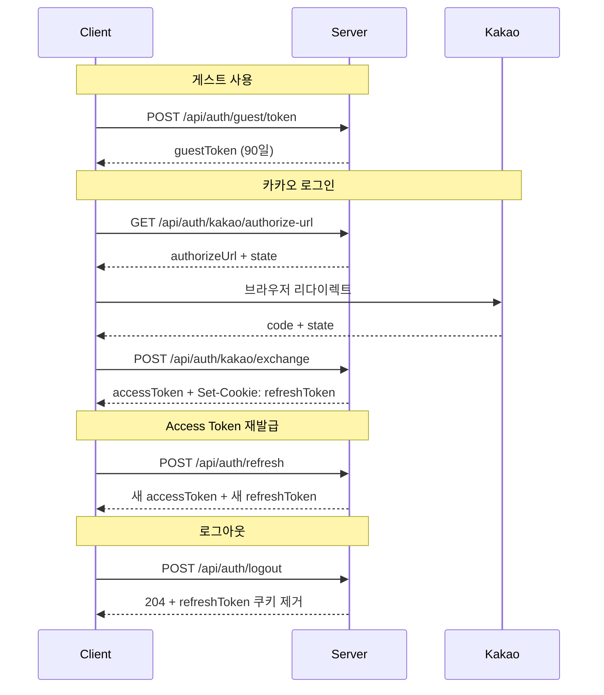

# API Reference – FlowMate

> Last updated: 2026-04-25

Base URL: `/api`

- 기본 요청/응답 Content-Type: `application/json`
- SSE 응답은 `text/event-stream`
- 날짜 포맷: `YYYY-MM-DD`
- 시간 스탬프 포맷: UTC ISO-8601 (`yyyy-MM-dd'T'HH:mm:ss'Z'`)

## 0. 공통 규칙

| 규칙                | 설명                                                                                                                                    |
|-------------------|---------------------------------------------------------------------------------------------------------------------------------------|
| Guest JWT         | `localStorage`에 90일 보관한다. 비로그인 사용자도 같은 API를 사용할 수 있게 하는 식별 토큰이다.                                                                      |
| Member Access JWT | 메모리(JS)에만 보관한다. 인증이 필요한 요청은 `Authorization: Bearer {token}` 헤더를 사용한다.                                                                 |
| Refresh Token     | HttpOnly 쿠키로만 전송한다. refresh 시 기존 RT 1개를 revoke하고 새 RT를 발급한다.                                                                          |
| SSE               | `GET /api/timer/sse`만 EventSource 제약 때문에 쿼리 파라미터 `token`을 사용한다. 상세 배경은 [architecture.md — SSE 아키텍처](./architecture.md#3-sse-아키텍처) 참고. |
| 리스트 응답            | 대부분 `{ "items": [...] }` 형태의 `ListResponse<T>`를 사용한다. 예외는 `GET /api/timer/state`의 직접 배열 반환이다.                                         |
| 도메인 용어            | `MiniDay`, `dayOrder`, `TodoSession`, `TimerState` 등 용어 정의는 [data-model.md — 개념적 모델링](./data-model.md#1-개념적-모델링) 참고.                  |

## 1. 인증

### 1.1 인증 토큰 모델

| 상황                | 사용 토큰                                |
|-------------------|--------------------------------------|
| 로그인 전             | Guest JWT                            |
| 카카오 로그인 후         | Member Access JWT + Refresh Token 쿠키 |
| Access Token 만료 시 | `POST /api/auth/refresh`             |

- 현재 OAuth 공급자는 `kakao`만 지원한다.
- `GET /api/auth/kakao/authorize-url`이 반환한 `state`는 클라이언트가 `sessionStorage`에 저장했다가 콜백에서 비교 후 즉시 제거한다.
- `GET /api/timer/sse`를 제외한 인증 요청은 모두 `Authorization: Bearer {token}` 헤더를 사용한다.

### 1.2 인증 흐름


```mermaid
sequenceDiagram
    participant C as Client
    participant S as Server
    participant K as Kakao
    Note over C, S: 게스트 사용
    C ->> S: POST /api/auth/guest/token
    S -->> C: guestToken (90일)
    Note over C, K: 카카오 로그인
    C ->> S: GET /api/auth/kakao/authorize-url
    S -->> C: authorizeUrl + state
    C ->> K: 브라우저 리다이렉트
    K -->> C: code + state
    C ->> S: POST /api/auth/kakao/exchange
    S -->> C: accessToken + Set-Cookie: refreshToken
    Note over C, S: Access Token 재발급
    C ->> S: POST /api/auth/refresh
    S -->> C: 새 accessToken + 새 refreshToken
    Note over C, S: 로그아웃
    C ->> S: POST /api/auth/logout
    S -->> C: 204 + refreshToken 쿠키 제거
```

### 1.3 게스트 토큰 발급

`POST /api/auth/guest/token`

**Auth** 불필요

**Response** `200`

```json
{
  "guestToken": "eyJ..."
}
```

---

### 1.4 카카오 로그인 URL 발급

`GET /api/auth/kakao/authorize-url`

**Auth** 불필요

**Response** `200`

```json
{
  "authorizeUrl": "https://kauth.kakao.com/...",
  "state": "eyJ..."
}
```

- 경로는 `/{provider}/authorize-url` 형태지만 현재 구현 공급자는 `kakao`만 있다.
- 서버는 state를 저장하지 않고 JWT 서명 검증만 수행한다.

---

### 1.5 카카오 인가코드 교환

`POST /api/auth/kakao/exchange`

**Auth** 불필요

**Body**

```json
{
  "code": "string",
  "state": "eyJ..."
}
```

**Response** `200`

```json
{
  "accessToken": "eyJ...",
  "user": {
    "id": "uuid",
    "email": "string|null",
    "nickname": "string"
  }
}
```

Set-Cookie:
`refreshToken=...; HttpOnly; SameSite=Lax; Path=/api/auth; Max-Age=1209600`

**Errors**

- `401 AUTHENTICATION_FAILED` state JWT 서명/만료 실패, state role 불일치
- `400 BAD_REQUEST` 인가 코드 오류 (Kakao 외부 응답 실패)

---

### 1.6 Access Token 재발급

`POST /api/auth/refresh`

**Auth** 불필요
Cookie: `refreshToken` 자동 전송

**Response** `200`

```json
{
  "accessToken": "eyJ...",
  "user": {
    "id": "uuid",
    "email": "string|null",
    "nickname": "string"
  }
}
```

Set-Cookie: 새 `refreshToken`으로 교체

**Errors**

- `401 Unauthorized` `refreshToken` 쿠키 없음 (Spring Security 기본 401, body 비어 있을 수 있음)
- `401 AUTHENTICATION_FAILED` `refreshToken` 무효 · 만료 · 폐기 (서비스 예외 → `AuthenticationFailedException`)

- 쿠키가 없으면 controller 가 즉시 `401` 을 반환한다.
- 쿠키는 있지만 토큰 검증에 실패하면 service 가 `AuthenticationFailedException` 을 던져 `GlobalExceptionHandler` 가 `401` JSON 응답으로 매핑한다.

---

### 1.7 로그아웃

`POST /api/auth/logout`

**Auth** 불필요
Cookie: `refreshToken` 자동 전송

**Response** `204`

- 현재 쿠키가 있으면 해당 RT를 revoke하고, 없어도 idempotent하게 종료한다.

---

## 2. 할 일 (Todo)

Guest JWT와 Member Access JWT 모두 사용 가능.

- `miniDay`는 `0..3` 범위를 사용하며, `0`은 미지정/전체 버킷이고 `1..3`은 `day1..day3`에 대응한다.

**대표 Todo 응답**

```json
{
  "id": "uuid",
  "title": "집중 작업",
  "note": "중요 메모",
  "date": "2026-03-19",
  "miniDay": 2,
  "dayOrder": 0,
  "isDone": false,
  "sessionCount": 1,
  "sessionFocusSeconds": 1500,
  "timerMode": "pomodoro",
  "reviewRound": null,
  "originalTodoId": null,
  "createdAt": "2026-03-19T10:00:00Z",
  "updatedAt": "2026-03-19T10:30:00Z"
}
```

### 2.1 목록 조회

`GET /api/todos`

쿼리 파라미터 (상호 배타):

- `date` optional, `YYYY-MM-DD` — 단일 날짜 조회
- `from` + `to` optional, `YYYY-MM-DD` — 기간 범위 조회 (둘 다 주어야 하며 `from <= to`)
- `date`와 `from`/`to`를 동시에 주면 `400 BAD_REQUEST`
- `from`/`to` 중 하나만 주거나 `from > to`이면 `400 BAD_REQUEST`
- 모두 생략하면 사용자 전체 Todo를 `date ASC`, `miniDay ASC`, `dayOrder ASC`, `createdAt ASC` 순으로 반환한다.

**Response** `200`

```json
{
  "items": [
    {
      "id": "uuid",
      "title": "집중 작업",
      "note": "중요 메모",
      "date": "2026-03-19",
      "miniDay": 2,
      "dayOrder": 0,
      "isDone": false,
      "sessionCount": 1,
      "sessionFocusSeconds": 1500,
      "timerMode": "pomodoro",
      "reviewRound": null,
      "originalTodoId": null,
      "createdAt": "2026-03-19T10:00:00Z",
      "updatedAt": "2026-03-19T10:30:00Z"
    }
  ]
}
```

- `date`가 있으면 해당 날짜 Todo만 반환한다.

---

### 2.2 생성

`POST /api/todos`

**Auth** Guest JWT or Member Access JWT

**Body**

```json
{
  "title": "string",
  "note": "string|null",
  "date": "2026-03-19",
  "miniDay": 0,
  "dayOrder": 0
}
```

- `title`: 1-200자
- `note`: optional
- `date`: `YYYY-MM-DD`
- `miniDay`: `0-3`
- `dayOrder`: `0` 이상

**Response** `201` `Todo`

---

### 2.3 수정

`PATCH /api/todos/{id}`

**Auth** Guest JWT or Member Access JWT

**Body** 전달한 필드만 변경

```json
{
  "title": "string",
  "note": null,
  "isDone": true,
  "date": "2026-03-20",
  "miniDay": 1,
  "dayOrder": 3,
  "timerMode": "stopwatch"
}
```

- `title`: null이면 미변경, blank면 `400 BAD_REQUEST`
- `note`: 필드 생략 시 미변경, 명시적 `null`이면 삭제
- `isDone`: optional
- `date`, `miniDay`, `dayOrder`: optional
- `timerMode`: `stopwatch | pomodoro | null`
- `timerMode: ""`도 null과 동일하게 해제 처리
- `sessionCount`, `sessionFocusSeconds`는 Session API로만 변경된다
- `reviewRound`, `originalTodoId`는 PATCH로 수정하지 않는다

**Response** `200` `Todo` (2.1 목록 조회의 Todo 객체와 동일한 구조)

---

### 2.4 복습 생성

`POST /api/todos/{id}/review-schedule`

**Auth** Guest JWT or Member Access JWT

**Body**

- 없음

**Response**

- `201 Created` 신규 복습 Todo 생성
- `200 OK` 이미 같은 회차가 있어 기존 복습 Todo 반환

```json
{
  "item": {
    "id": "uuid",
    "title": "집중 작업",
    "note": "중요 메모",
    "date": "2026-03-22",
    "miniDay": 0,
    "dayOrder": 0,
    "isDone": false,
    "sessionCount": 0,
    "sessionFocusSeconds": 0,
    "timerMode": null,
    "reviewRound": 1,
    "originalTodoId": "root-todo-id",
    "createdAt": "2026-03-21T10:00:00Z",
    "updatedAt": "2026-03-21T10:00:00Z"
  },
  "created": true
}
```

**동작 규칙**

- 완료된 Todo만 복습 생성이 가능하다.
- 일반 Todo는 1회차, 완료된 복습 Todo는 다음 회차를 생성한다.
- 간격은 `1 → 2 → 4 → 8 → 16 → 32일` 고정이다.
- 다음 복습 날짜는 `복습하기`를 누른 오늘이 아니라, 현재 완료된 Todo의 `date`에 간격을 더해 계산한다.
- system은 review Todo 제목에 회차 prefix를 추가 저장하지 않고, 회차 표시는 `reviewRound`로 판단한다.
- 제목은 어떤 경우에도 system이 임의 정규화하지 않는다. 일반 Todo와 review Todo 모두 현재 source title을 그대로 사용한다.
- 새 복습 Todo는 `miniDay=0`, `isDone=false`, `sessionCount=0`, `sessionFocusSeconds=0`, `timerMode=null` 로 생성된다.
- 같은 사용자 기준 `(originalTodoId, reviewRound)` 조합은 하나만 존재하며, 중복 요청 시 기존 Todo를 반환한다.
- `reviewRound=6` 완료 Todo는 더 이상 다음 복습을 만들 수 없다.
- 원본 Todo가 삭제돼도 기존 복습 Todo는 유지된다.

**Errors**

- `409 TODO_STATE_VIOLATION` 미완료 Todo, 6회차 초과 (`TodoStateViolationException`)
- `404 NOT_FOUND` Todo 없음 또는 타 사용자 소유

---

### 2.5 순서 변경

`PUT /api/todos/reorder`

**Auth** Guest JWT or Member Access JWT

**Body**

```json
{
  "items": [
    {
      "id": "uuid",
      "dayOrder": 0,
      "miniDay": 1
    }
  ]
}
```

**Response** `200`

```json
{
  "items": [
    {
      "id": "uuid",
      "title": "집중 작업",
      "note": "중요 메모",
      "date": "2026-03-19",
      "miniDay": 1,
      "dayOrder": 0,
      "isDone": false,
      "sessionCount": 1,
      "sessionFocusSeconds": 1500,
      "timerMode": "pomodoro",
      "reviewRound": null,
      "originalTodoId": null,
      "createdAt": "2026-03-19T10:00:00Z",
      "updatedAt": "2026-03-19T10:30:00Z"
    }
  ]
}
```

**동작 규칙**

- 요청 `items[].id` 중 하나라도 존재하지 않거나 타 사용자 소유이면 **전체 거부**하고 `404 NOT_FOUND`를 반환한다 (all-or-nothing, 트랜잭션 rollback).
- 응답 `items`는 갱신 반영된 사용자 전체 Todo를 `date ASC`, `miniDay ASC`, `dayOrder ASC`, `createdAt ASC` 순으로 반환한다.

**Errors**

- `400 BAD_REQUEST` `items[].id` 에 중복이 있으면 silent last-write 대신 전체 거부
- `404 NOT_FOUND` `items[].id` 중 일부가 없거나 타 사용자 소유

---

### 2.6 삭제

`DELETE /api/todos/{id}`

**Auth** Guest JWT or Member Access JWT

**Response** `204`

---

### Todo 동작 메모

API 자체는 `PATCH /api/todos/{id}`와 `POST /api/todos` 조합으로 날짜 이동/복제를 표현한다.

| 액션                          | 동작         | 변경 필드                                                                                    |
|-----------------------------|------------|------------------------------------------------------------------------------------------|
| 날짜 바꾸기, 오늘하기, 내일 하기         | 기존 Todo 수정 | `date`, `dayOrder`, 필요 시 `miniDay`                                                       |
| 오늘 또 하기, 내일 또 하기, 다른 날 또 하기 | 새 Todo 생성  | `miniDay=0`, `isDone=false`, `sessionCount=0`, `sessionFocusSeconds=0`, `timerMode=null` |
| 복습하기                        | 새 Todo 생성  | `title={기준 제목 그대로}`, `date=currentTodo.date+interval`, `miniDay=0`, `reviewRound=1..6`, `originalTodoId={rootTodoId}` |

| 상태  | 과거 날짜                      | 오늘 날짜                      | 미래 날짜                      |
|-----|----------------------------|----------------------------|----------------------------|
| 미완료 | 오늘하기, 날짜 바꾸기               | 내일 하기, 날짜 바꾸기              | 오늘하기, 날짜 바꾸기               |
| 완료  | 복습하기, 오늘 또 하기, 다른 날 또 하기, 날짜 바꾸기 | 복습하기, 내일 또 하기, 다른 날 또 하기, 날짜 바꾸기 | 복습하기, 오늘 또 하기, 다른 날 또 하기, 날짜 바꾸기 |

---

## 3. 세션 (TodoSession)

Guest JWT와 Member Access JWT 모두 사용 가능.

**대표 Session 응답**

```json
{
  "id": "uuid",
  "todoId": "uuid",
  "sessionFocusSeconds": 1500,
  "breakSeconds": 300,
  "sessionOrder": 1,
  "createdAt": "2026-03-19T10:30:00Z"
}
```

### 3.1 목록 조회

`GET /api/todos/{todoId}/sessions`

**Response** `200`

```json
{
  "items": [
    {
      "id": "uuid",
      "todoId": "uuid",
      "sessionFocusSeconds": 1500,
      "breakSeconds": 300,
      "sessionOrder": 1,
      "createdAt": "2026-03-19T10:30:00Z"
    }
  ]
}
```

---

### 3.2 생성

`POST /api/todos/{todoId}/sessions`

**Auth** Guest JWT or Member Access JWT

**Body**

```json
{
  "sessionFocusSeconds": 1500,
  "breakSeconds": 300,
  "clientSessionId": "uuid"
}
```

- `sessionFocusSeconds`: `1-43200`
- `breakSeconds`: `0-43200`, 생략 또는 `null`이면 `0`
- `clientSessionId`: UUID, 멱등성 키

**Response**

- `201 Created` 신규 세션 생성
- `200 OK` 동일 `todoId + clientSessionId` 재요청

**동작 규칙**

- 동일 `clientSessionId` 재요청 시 `sessionFocusSeconds`가 같아야 한다.
- 동일 `clientSessionId` 재요청 시 `breakSeconds`는 기존 값보다 클 때만 반영된다.
- 신규 생성 시 Todo의 `sessionCount`, `sessionFocusSeconds` 집계도 함께 증가한다.

**Errors**

- `409 IDEMPOTENCY_CONFLICT` 동일 `clientSessionId` 재사용 시 `sessionFocusSeconds` 불일치 (`IdempotencyConflictException`)
- `404 NOT_FOUND` Todo 없음 또는 타 사용자 소유

---

## 4. 타이머 동기화 (Timer Sync)

Member Access JWT 전용.

> 멀티탭·기기 간 타이머 상태 일관성을 위해 SSE 브로드캐스트를 사용한다.
> 클라이언트는 `version` 단조 증가 값을 기준으로 이벤트 중복 적용을 방지한다.

### 4.1 SSE 구독

`GET /api/timer/sse?token={accessToken}`

> EventSource가 Authorization 헤더를 지원하지 않아, SSE 엔드포인트만 예외적으로 쿼리 파라미터 `token`을 사용한다.

**Response** `200` `text/event-stream`

| Event         | Data                          | 설명          |
|---------------|-------------------------------|-------------|
| `connected`   | `ok`                          | 연결 직후 1회    |
| `heartbeat`   | `keepalive`                   | 약 25초 간격    |
| `timer-state` | `TimerStateResponse` JSON 문자열 | 타이머 상태 변경 시 |

`connected`, `heartbeat`는 무시 가능하다. 실제 상태 반영 대상은 `timer-state`만이다.

**재연결**

- 브라우저 `EventSource`는 끊기면 자동 재연결한다.
- 앱 초기화·회원 복원 시 `GET /api/timer/state`로 스냅샷을 fetch하고, SSE `timer-state` 이벤트는 `version`으로 비교해 중복 적용을 막는다.

**Errors**

- `401 AUTHENTICATION_FAILED` 유효하지 않은 토큰 (서명 오류, 만료, 파싱 실패)
- `401 AUTHENTICATION_FAILED` member 아님 (게스트 토큰 차단)

---

### 4.2 타이머 상태 Push

`PUT /api/timer/state/{todoId}`

**Auth** Member Access JWT

**Body**

```json
{
  "status": "running",
  "state": {
    "mode": "pomodoro",
    "status": "running",
    "phase": "flow",
    "remainingMs": 1200000,
    "elapsedMs": 300000,
    "cycleCount": 1,
    "sessions": []
  }
}
```

- `status`: `idle | running | paused | waiting`
- `status=idle`이면 `state`는 `null`
- `status!=idle`이면 `state`는 non-null
- 저장 후 같은 `userId`의 SSE 연결에 `timer-state` 이벤트를 브로드캐스트한다.
- `status=idle` 요청도 `200`으로 정상 처리되며, 이 경우 서버는 `state=null`로 저장하고 `version`만 갱신한다.

**SingleTimerState 구조**

- 공통: `mode`, `status`, `endAt: number | null`, `elapsedMs`, `cycleCount`, `sessions`
- pomodoro 전용: `phase`, `remainingMs: number | null`, `settingsSnapshot`
- stopwatch 전용: `flexiblePhase`, `focusElapsedMs`, `breakElapsedMs`
- `sessions`: `{ sessionFocusSeconds, breakSeconds, clientSessionId }[]`

**Response** `200`

```json
{
  "todoId": "uuid",
  "state": {
    "mode": "pomodoro",
    "status": "running",
    "phase": "flow",
    "remainingMs": 1200000,
    "elapsedMs": 300000,
    "cycleCount": 1,
    "sessions": []
  },
  "version": 1772454032001
}
```

- `version`: `max(System.currentTimeMillis(), lastVersion + 1)`

**Errors**

- `400 BAD_REQUEST` idle/state 조합 불일치
- `401` 미인증 또는 게스트 토큰으로 요청한 경우 (멤버 전용 엔드포인트)
- `404 NOT_FOUND` 해당 Todo 없음 또는 타 사용자 소유

---

### 4.3 활성 타이머 목록 조회

`GET /api/timer/state`

**Auth** Member Access JWT

**Response** `200`

```json
[
  {
    "todoId": "uuid",
    "state": {
      "mode": "pomodoro",
      "status": "paused",
      "phase": "flow",
      "remainingMs": 900000,
      "elapsedMs": 600000,
      "cycleCount": 1,
      "sessions": []
    },
    "version": 1772454032001
  }
]
```

- idle 상태(`state_json = null`)는 제외된다.
- 24시간이 지난 stale row는 정리 대상이며 응답에서도 제외된다.
- 다른 리스트 endpoint와 달리 배열을 직접 반환한다. 타이머 상태는 SSE 수신 후 즉시 병합하는 런타임 스냅샷이므로 `ListResponse` 래핑 없이 최소한의 구조로 전달한다.

---

## 5. 설정 (Settings)

**Auth** 모든 Settings API는 Guest JWT와 Member Access JWT를 모두 허용한다.

row가 없으면 기본값으로 응답하고, 수정 시점에만 row를 생성한다.

기본값:

- Pomodoro: `flowMin=25`, `breakMin=5`, `longBreakMin=15`, `cycleEvery=4`
- Automation: `autoStartBreak=false`, `autoStartSession=false`
- MiniDay: 오전 `06:00-12:00`, 오후 `12:00-18:00`, 저녁 `18:00-24:00`

**대표 Settings 응답**

```json
{
  "pomodoroSession": {
    "flowMin": 25,
    "breakMin": 5,
    "longBreakMin": 15,
    "cycleEvery": 4
  },
  "automation": {
    "autoStartBreak": false,
    "autoStartSession": false
  },
  "miniDays": {
    "day1": {
      "label": "오전",
      "start": "06:00",
      "end": "12:00"
    },
    "day2": {
      "label": "오후",
      "start": "12:00",
      "end": "18:00"
    },
    "day3": {
      "label": "저녁",
      "start": "18:00",
      "end": "24:00"
    }
  }
}
```

### 5.1 전체 조회

`GET /api/settings`

**Response** `200` `SettingsResponse`

---

### 5.2 뽀모도로 세션 설정 수정

`PUT /api/settings/pomodoro-session`

**Body**

```json
{
  "flowMin": 25,
  "breakMin": 5,
  "longBreakMin": 15,
  "cycleEvery": 4
}
```

- `flowMin`, `breakMin`, `longBreakMin`: `1-90`
- `cycleEvery`: `1-10`

**Response** `200`

```json
{
  "flowMin": 25,
  "breakMin": 5,
  "longBreakMin": 15,
  "cycleEvery": 4
}
```

---

### 5.3 자동화 설정 수정

`PUT /api/settings/automation`

**Body**

```json
{
  "autoStartBreak": false,
  "autoStartSession": false
}
```

**Response** `200`

```json
{
  "autoStartBreak": false,
  "autoStartSession": false
}
```

---

### 5.4 MiniDay 조회

`GET /api/settings/mini-days`

**Response** `200`

```json
{
  "day1": {
    "label": "오전",
    "start": "06:00",
    "end": "12:00"
  },
  "day2": {
    "label": "오후",
    "start": "12:00",
    "end": "18:00"
  },
  "day3": {
    "label": "저녁",
    "start": "18:00",
    "end": "24:00"
  }
}
```

---

### 5.5 MiniDay 수정

`PUT /api/settings/mini-days`

**Body**

```json
{
  "day1": {
    "label": "오전",
    "start": "06:00",
    "end": "12:00"
  },
  "day2": {
    "label": "오후",
    "start": "12:00",
    "end": "18:00"
  },
  "day3": {
    "label": "저녁",
    "start": "18:00",
    "end": "24:00"
  }
}
```

- `label`: 1-50자
- `start`: `HH:mm`
- `end`: `HH:mm` 또는 `24:00`
- `start < end` 이어야 한다

**Response** `200` `MiniDaysSettingsResponse`

---

## 6. 회고 (Reviews)

Guest JWT와 Member Access JWT 모두 사용 가능.

단건은 `GET /api/reviews/{periodStart}?type=...`로, 목록은 `GET /api/reviews?type&from&to`로 분리되어 있다.

**대표 Review 응답**

```json
{
  "id": "uuid",
  "type": "weekly",
  "periodStart": "2026-03-16",
  "periodEnd": "2026-03-22",
  "content": "이번 주 회고",
  "createdAt": "2026-03-19T10:00:00Z",
  "updatedAt": "2026-03-19T10:10:00Z"
}
```

### 6.1 단건 조회

`GET /api/reviews/{periodStart}?type={type}`

- `periodStart` (path): daily는 임의 날짜, weekly는 월요일, monthly는 매월 1일
- `type` (query): `daily | weekly | monthly`

**Response**

- `200 OK` — 회고가 존재하면 `Review` 본문 반환
- `204 No Content` — 해당 기간의 회고가 없는 경우 (본문 없음)

---

### 6.2 기간 목록 조회

`GET /api/reviews?type={type}&from=YYYY-MM-DD&to=YYYY-MM-DD`

**Response** `200`

```json
{
  "items": [
    {
      "id": "uuid",
      "type": "weekly",
      "periodStart": "2026-03-16",
      "periodEnd": "2026-03-22",
      "content": "이번 주 회고",
      "createdAt": "2026-03-19T10:00:00Z",
      "updatedAt": "2026-03-19T10:10:00Z"
    }
  ]
}
```

---

### 6.3 Upsert

`PUT /api/reviews`

**Body**

```json
{
  "type": "weekly",
  "periodStart": "2026-03-16",
  "periodEnd": "2026-03-22",
  "content": "이번 주 회고"
}
```

`periodEnd` 규칙:

| type    | periodEnd           |
|---------|---------------------|
| daily   | `periodStart`와 같은 날 |
| weekly  | `periodStart + 6일`  |
| monthly | 해당 월 마지막 날          |

서버는 클라이언트가 보낸 `periodEnd`를 그대로 저장하며, `periodStart <= periodEnd`만 검증한다.

**Response** `200` `Review`

- 같은 `userId + type + periodStart`가 있으면 수정, 없으면 생성한다.

---

### 6.4 삭제

`DELETE /api/reviews/{id}`

**Response** `204`

---

## 7. 오류 모델 (Errors)

`ApiError` 본문을 사용하는 경우 형식은 아래와 같다.

```json
{
  "error": {
    "code": "VALIDATION_ERROR",
    "message": "validation failed",
    "fields": {
      "title": "title must be at most 200 characters"
    }
  }
}
```

| 코드 / 상태                    | HTTP | 설명                                                                 |
|----------------------------|------|--------------------------------------------------------------------|
| `VALIDATION_ERROR`         | 400  | `@Valid`, 제약조건 위반, 필드 단위 오류                                        |
| `BAD_REQUEST`              | 400  | 서비스 규칙 위반, 잘못된 파라미터 조합, VO 불변식 위반 등                               |
| `AUTHENTICATION_FAILED`    | 401  | JWT · Refresh Token · SSE subscribe 토큰 검증 실패 (`AuthenticationFailedException`) |
| `NOT_FOUND`                | 404  | 리소스 없음 또는 타 사용자 소유                                                 |
| `METHOD_NOT_ALLOWED`       | 405  | 경로는 존재하지만 HTTP 메서드가 미지원                                           |
| `CONFLICT`                 | 409  | 데드락 retry 소진 등 일시적 충돌                                              |
| `IDEMPOTENCY_CONFLICT`     | 409  | 동일 idempotency key 재사용 + payload 불일치 (세션 `sessionFocusSeconds` mismatch 등) |
| `TODO_STATE_VIOLATION`     | 409  | Todo 상태 위반 (미완료 복습 스케줄, MAX_REVIEW_ROUND 초과 등)                    |
| `INTERNAL_ERROR`           | 500  | 처리되지 않은 예외, 방어 코드 ISE                                              |
| `UNAUTHORIZED`             | 401  | Spring Security 인증 실패. body 가 비어 있을 수 있음                           |
| `FORBIDDEN`                | 403  | Spring Security 인가 실패. body 가 비어 있을 수 있음                           |

참고:

- `409 CONFLICT` 는 `CannotAcquireLockException`(데드락 retry 소진) 에만 사용된다. `IDEMPOTENCY_CONFLICT` / `TODO_STATE_VIOLATION` 은 별도 code 로 구분.
- `GET /api/timer/sse` 는 SecurityFilter 가 아니라 controller 내부 검증을 사용하므로, invalid token / non-member 가 `401 AUTHENTICATION_FAILED` 로 내려온다 (이전 버전에서는 400 이었음 — Phase 2 에서 semantic 정합 교체).
- `UNAUTHORIZED`, `FORBIDDEN` 은 Spring Security 가 만드는 HTTP 상태이며, `ApiError.error.code` 를 항상 의미하지는 않는다. 서비스 레이어에서 던지는 도메인 401 은 `AUTHENTICATION_FAILED` code 를 사용한다.
