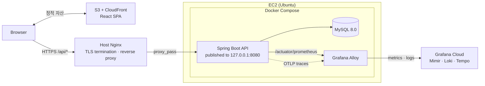
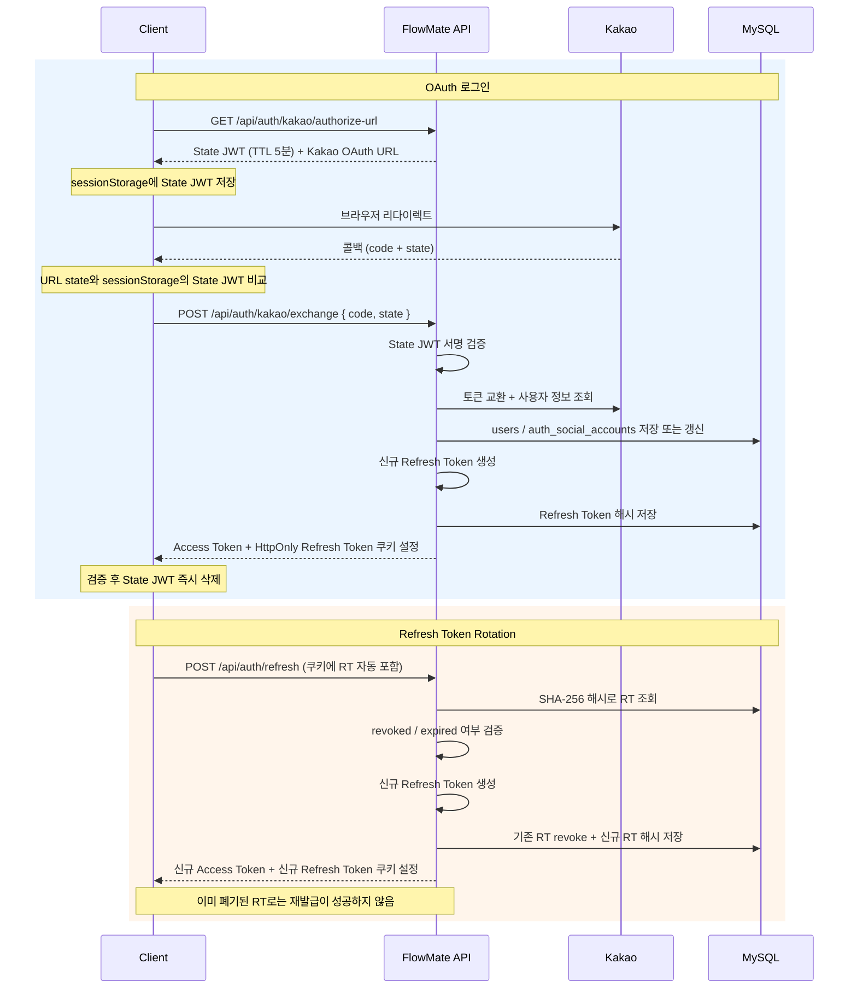
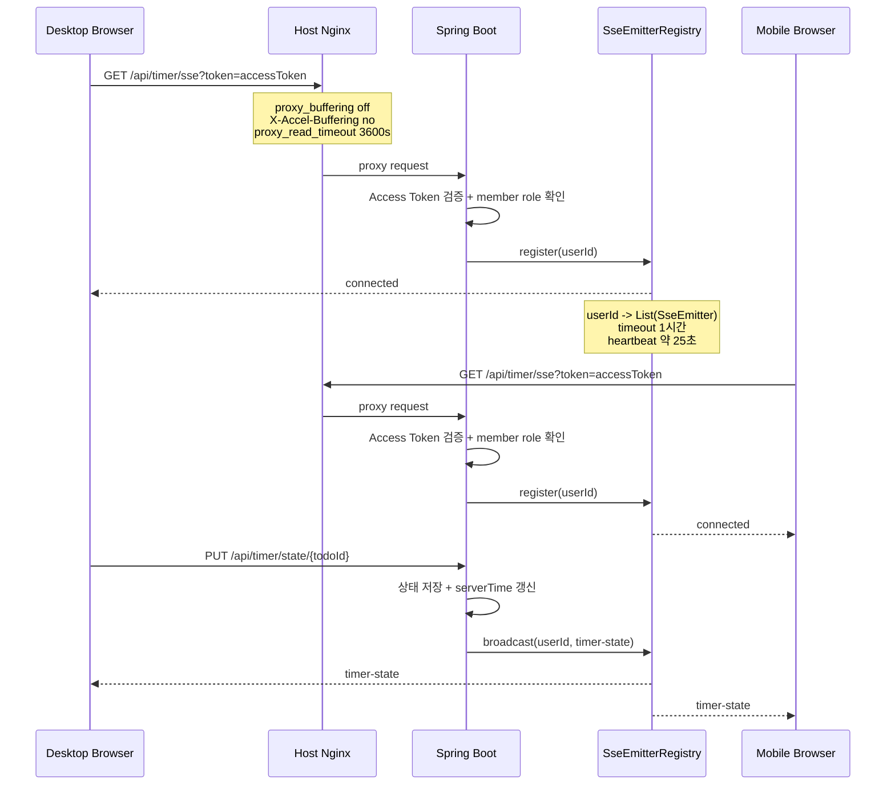
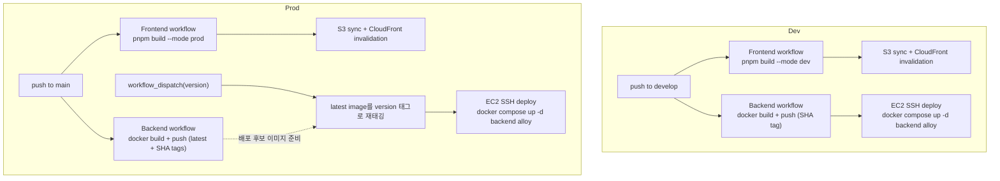

# FlowMate 아키텍처

> Last updated: 2026-03-28
>
> 관련 문서: [API Reference](api.md) · [Data Model](data-model.md)

## 1. AWS 기반 시스템 아키텍처

- 프론트엔드는 S3 + CloudFront를 통해 정적 React SPA로 제공한다.
- API 요청은 별도 도메인으로 EC2의 호스트 Nginx에 진입하며, Nginx가 TLS 종료와 reverse proxy를 담당한다.
- 백엔드는 Docker Compose 기반으로 backend, mysql, alloy 컨테이너로 구성되며, Spring Boot는 127.0.0.1:8080으로만 노출된다.
- Alloy는 메트릭과 로그를 Grafana Cloud로 전송하고, trace 수집을 위한 OTLP 경로도 준비돼 있다.

- `/api/timer/sse`는 Nginx에서 별도 location으로 분리하고, proxy buffering을 비활성화해 장기 연결을 유지한다.
- 외부 health check는 `/actuator/health`만 허용하고, 나머지 actuator 경로는 Nginx에서 차단한다.

## 2. 인증 아키텍처

### 1) 토큰 전략

| 토큰                | 저장 위치                    | TTL | 목적                  |
|-------------------|--------------------------|-----|---------------------|
| Guest JWT         | localStorage             | 90일 | 비로그인 사용자 식별 및 상태 유지 |
| Member Access JWT | 브라우저 메모리                 | 15분 | API 인가              |
| State JWT         | sessionStorage (콜백 후 삭제) | 5분  | OAuth CSRF 방지       |
| Refresh Token     | HttpOnly 쿠키              | 14일 | Access JWT 재발급      |

- 현재 OAuth 공급자는 `kakao`만 지원한다.
- State JWT는 클라이언트가 콜백 검증 직후 sessionStorage에서 즉시 제거하며, 서버는 state를 별도로 저장하지 않고 서명 검증만 수행한다.
- Refresh Token은 DB에 평문이 아니라 SHA-256 해시로 저장하고, 재발급 시에는 기존 토큰을 revoke한 뒤 새 토큰으로 교체한다.

### 2) OAuth 로그인 플로우 & Refresh Token Rotation

- Guest 사용자는 Guest JWT로 시작하고, 회원 로그인 후에는 Member Access JWT + Refresh Token 조합으로 전환된다.
- refresh 시 기존 RT를 즉시 revoke하고 새 RT로 교체하므로, 이미 폐기된 RT로는 이후 재발급이 성공하지 않는다.

## 3. SSE 아키텍처

- SSE 엔드포인트는 Member Access JWT 기반 로그인 사용자 전용이다.
- EventSource가 Authorization 헤더를 지원하지 않아 `GET /api/timer/sse?token={accessToken}` 형태를 사용한다.
- 같은 회원의 여러 탭과 기기에 timer-state 이벤트를 브로드캐스트한다

- `connected`와 `heartbeat`는 연결 유지 및 생존 확인용 이벤트이며, 클라이언트 상태 동기화에는 `timer-state`만 반영한다.
- 서버는 타이머 상태를 저장한 뒤 같은 `userId`에 연결된 모든 SSE emitter로 최신 상태를 브로드캐스트한다.

## 4. 인프라 및 배포

### 1) 배포 프로세스

| 환경   | 프론트엔드                                                     | 백엔드                                                              | 비고                     |
|------|-----------------------------------------------------------|------------------------------------------------------------------|------------------------|
| Dev  | `develop` push → build → S3 업로드 + CloudFront invalidation | `develop` push → image build/push → EC2 SSH deploy               | `backend`, `alloy` 재기동 |
| Prod | `main` push → build → S3 업로드 + CloudFront invalidation    | `main` push → image publish, `workflow_dispatch(version)`로 수동 배포 | 지정 version 반영          |

- 프론트엔드는 EC2를 거치지 않고 S3 + CloudFront로 직접 배포된다.
- API 도메인은 호스트 Nginx가 받고, 실제 애플리케이션 런타임은 EC2 내부 Docker Compose가 담당한다.

### 2) CI/CD 파이프라인

- Dev는 브랜치 push만으로 프론트엔드와 백엔드를 모두 자동 배포한다.
- Prod는 프론트엔드는 자동 배포하되, 백엔드는 image publish와 실제 배포를 분리해 운영자가 지정한 version만 반영한다.