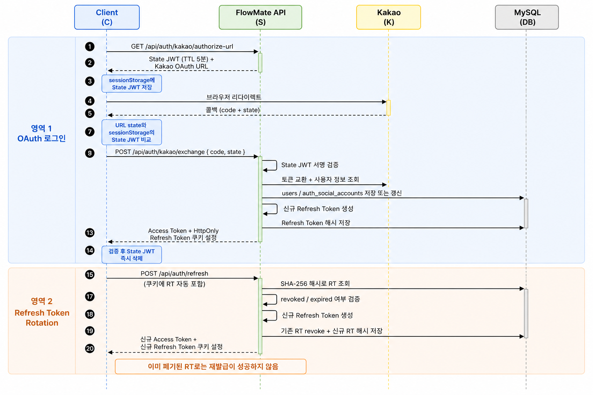
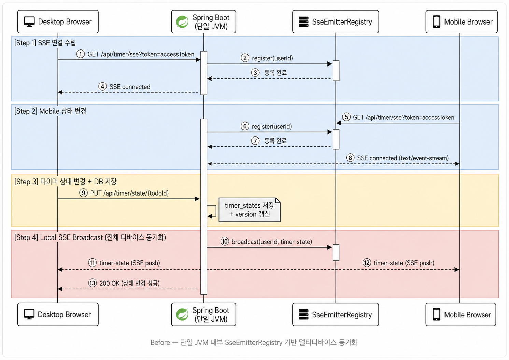
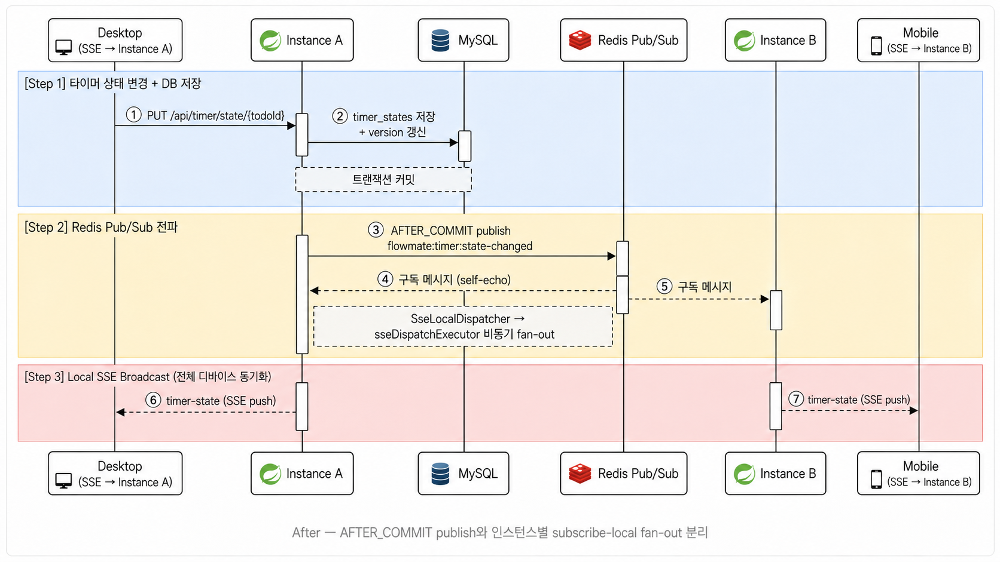
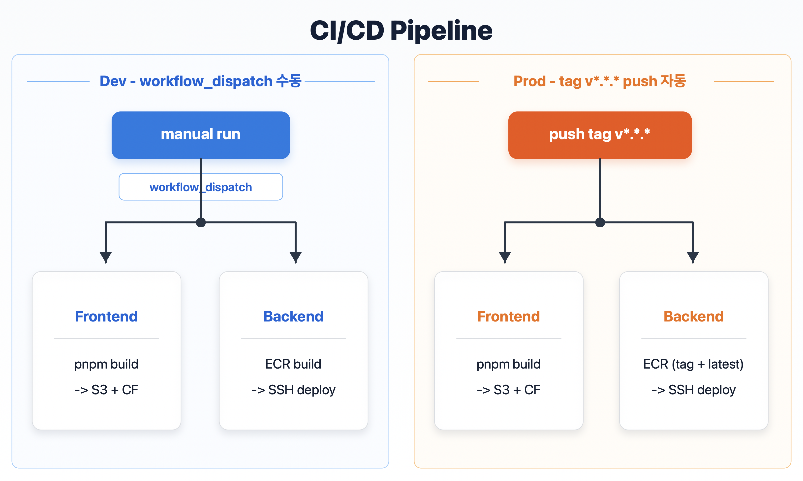

# FlowMate 아키텍처

> Last updated: 2026-07-04
>
> 관련 문서: [API Reference](api.md), [Data Model](data-model.md)

## 1. AWS 기반 시스템 아키텍처

- 프론트엔드는 S3 + CloudFront를 통해 정적 React SPA로 제공한다.
- API 요청은 별도 도메인으로 EC2의 호스트 Nginx에 진입하며, Nginx가 TLS 종료와 reverse proxy를 담당한다.
- 백엔드는 Docker Compose로 backend, mysql, redis, alloy 4개 컨테이너로 구성되며, Spring Boot는 127.0.0.1:8080으로만 노출된다.
- 현재 Redis는 SSE 타이머 이벤트를 인스턴스 간에 전파하는 Pub/Sub 채널로만 쓴다.
- Alloy는 메트릭과 로그를 Grafana Cloud로 전송하고, trace 수집을 위한 OTLP 경로도 준비돼 있다.

- `/api/timer/sse`는 Nginx에서 별도 location으로 분리하고, proxy buffering을 비활성화해 장기 연결을 유지한다.
- 외부 health check는 `/actuator/health`만 허용하고, 나머지 actuator 경로는 Nginx에서 차단한다.

## 2. 인증 아키텍처

### 1) 토큰 전략

| 토큰                | 저장 위치                    | TTL | 목적                  |
|-------------------|--------------------------|-----|---------------------|
| Guest JWT         | localStorage             | 90일 | 비로그인 사용자 식별 및 상태 유지 |
| Member Access JWT | 브라우저 메모리                 | 15분 | API 인가              |
| State JWT         | sessionStorage (콜백 후 삭제) | 5분  | OAuth CSRF 방지       |
| Refresh Token     | HttpOnly 쿠키              | 14일 | Access JWT 재발급      |

- 현재 OAuth 공급자는 `kakao`만 지원한다.
- State JWT는 클라이언트가 콜백 검증 직후 sessionStorage에서 즉시 제거하며, 서버는 state를 별도로 저장하지 않고 서명 검증만 수행한다.
- Refresh Token은 DB에 평문이 아니라 SHA-256 해시로 저장하고, 재발급 시에는 기존 토큰을 revoke한 뒤 새 토큰으로 교체한다.

### 2) OAuth 로그인 플로우 & Refresh Token Rotation

- Guest 사용자는 Guest JWT로 시작하고, 회원 로그인 후에는 Member Access JWT + Refresh Token 조합으로 전환된다.
- refresh 시 기존 RT를 즉시 revoke하고 새 RT로 교체하므로, 이미 폐기된 RT로는 이후 재발급이 성공하지 않는다.
- 폐기된 RT로 재사용을 시도하면 401로 차단하고, 같은 사용자의 active RT 전체를 revoke한다.
- reuse detection의 전체 폐기는 별도 서비스의 `REQUIRES_NEW` 트랜잭션에서 먼저 커밋한다. 이후 401 예외로 refresh 트랜잭션이 rollback되어도 폐기 결과가 DB에 남는다.
- 로그인은 기존 활성 RT를 유지한 채 새 RT를 추가 발급한다. 같은 회원이 여러 디바이스에서 동시에 세션을 유지할 수 있으며, SSE 멀티디바이스 동기화 전제와 정합한다.

## 3. SSE 아키텍처

- SSE 엔드포인트는 Member Access JWT 기반 로그인 사용자 전용이다.
- EventSource가 Authorization 헤더를 지원하지 않아 `GET /api/timer/sse?token={accessToken}` 형태를 사용한다.
- 같은 회원의 여러 탭과 기기에 timer-state 이벤트를 브로드캐스트한다.
- 단일 인스턴스에서는 `SseEmitterRegistry`가 JVM 메모리에서 직접 broadcast하고, 다중 인스턴스에서는 Redis Pub/Sub으로 인스턴스 간 이벤트를 전파한다.

**Before: 단일 JVM 내부 SseEmitterRegistry 기반 멀티디바이스 동기화**

**After: AFTER_COMMIT publish와 인스턴스별 subscribe-local fan-out 분리**

- `connected`와 `heartbeat`(~25초)는 연결 유지 및 생존 확인용 이벤트이며, 클라이언트 상태 동기화에는 `timer-state`만 반영한다.
- `TimerService`는 DB 저장과 도메인 이벤트 발행까지만 담당하고, `SseBroadcaster`(AFTER_COMMIT publish)와 `SseLocalDispatcher`(Redis 구독 -> 로컬
  fan-out)가 전파를 처리한다.
- 자세한 내용은 [SSE로 멀티디바이스 타이머 동기화하기](wiki/sse-sync.md) 및 [Redis Pub/Sub으로 SSE 수평 확장하기](wiki/redis-sse-pubsub.md)를 참고한다.

## 4. 인프라 및 배포

### 1) 배포 프로세스

| 환경   | 프론트엔드 (S3+CF)                                                        | 백엔드 (EC2, AI 리포트 도메인 포함)                                 |
|------|----------------------------------------------------------------------|----------------------------------------------------------|
| Dev  | `workflow_dispatch` 수동 실행 -> pnpm build -> S3 sync + CF invalidation | `workflow_dispatch` 수동 실행 -> ECR build -> EC2 SSH deploy |
| Prod | tag `v*.*.*` push -> pnpm build -> S3 sync + CF invalidation         | tag push -> ECR build (tag + latest) -> EC2 SSH deploy   |

- dev는 비용 절감을 위해 dev EC2를 평소엔 중지하면서 `workflow_dispatch` 수동 실행으로 전환했다 (v1.12.5). 기존 `main` push 자동 트리거(
  `paths` 필터 포함)는 워크플로우에 주석으로 보존해 필요 시 바로 복원할 수 있다.
- prod는 tag `v*.*.*` push 한 번으로 FE/BE가 동시 자동 배포된다. glob 가드로 `archive/*`, `pre-release/*`, `hotfix/*` 등 비-semver tag는
  prod 트리거 안 됨.
- 코드는 동일하고 환경 차이는 `infra/{dev,prod}/` 디렉토리 + Spring profile + 환경변수로 흡수한다.

### 2) CI/CD 파이프라인

