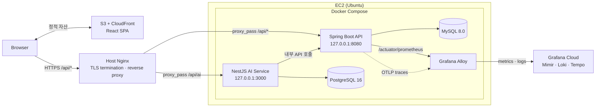
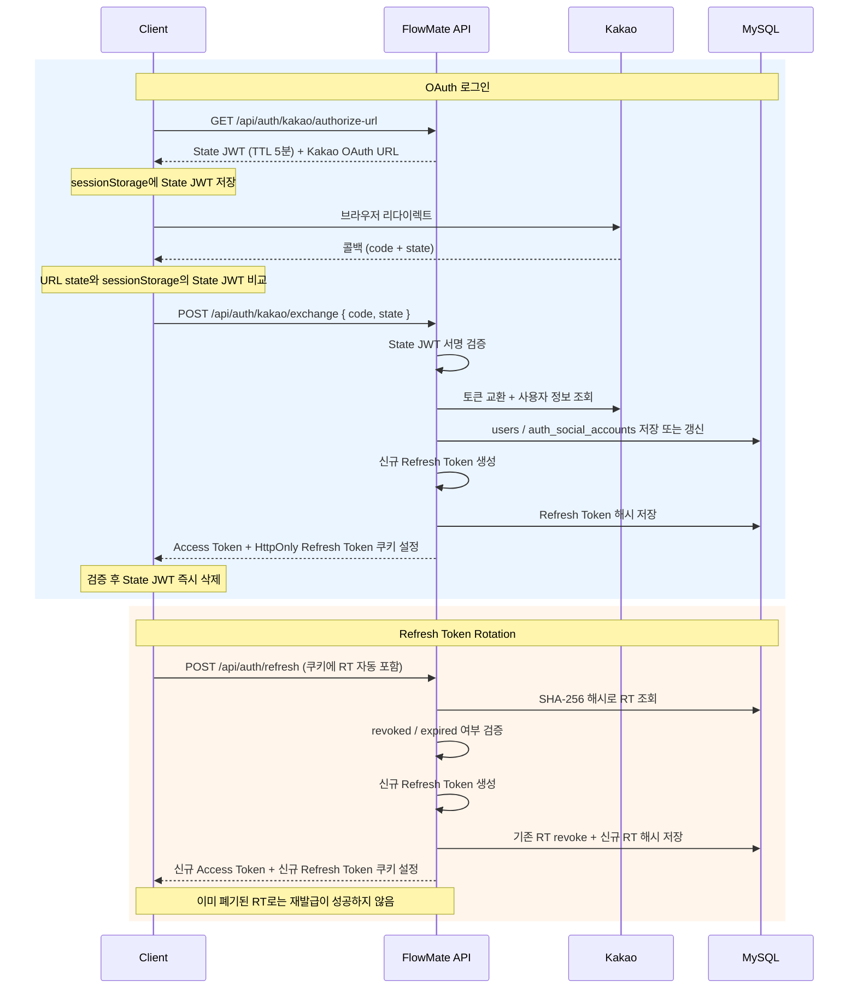
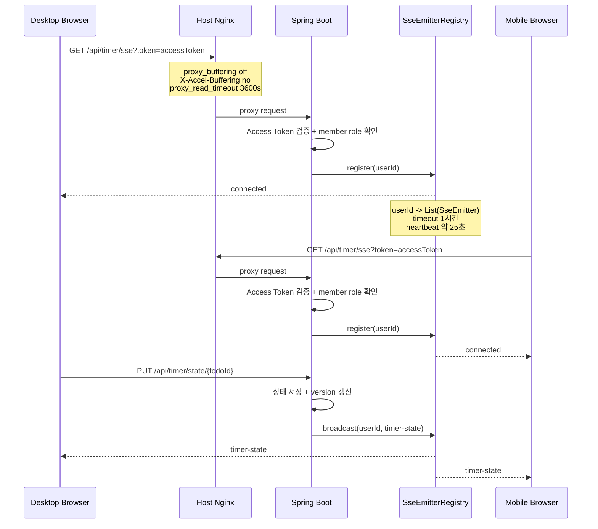
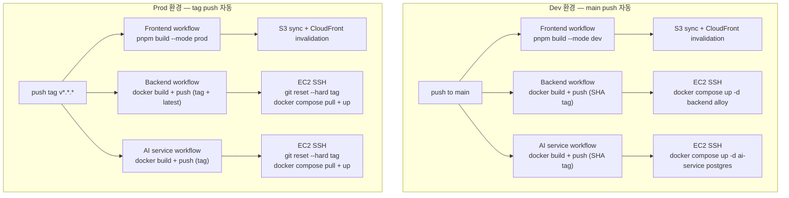

# FlowMate 아키텍처

> Last updated: 2026-04-28
>
> 관련 문서: [API Reference](api.md) · [Data Model](data-model.md)

## 1. AWS 기반 시스템 아키텍처

- 프론트엔드는 S3 + CloudFront를 통해 정적 React SPA로 제공한다.
- API 요청은 별도 도메인으로 EC2의 호스트 Nginx에 진입하며, Nginx가 TLS 종료와 reverse proxy를 담당한다.
- 백엔드는 Docker Compose 기반으로 backend, mysql, ai-service(NestJS), postgres, alloy 컨테이너로 구성되며, Spring Boot는 127.0.0.1:8080, AI Service는 127.0.0.1:3000으로만 노출된다.
- Alloy는 메트릭과 로그를 Grafana Cloud로 전송하고, trace 수집을 위한 OTLP 경로도 준비돼 있다.

```mermaid
flowchart LR
    Browser["Browser"]
    CDN["S3 + CloudFront<br/>React SPA"]
    Nginx["Host Nginx<br/>TLS termination · reverse proxy"]

    subgraph EC2["EC2 (Ubuntu)"]
        direction TB
        subgraph Compose["Docker Compose"]
            Backend["Spring Boot API<br/>127.0.0.1:8080"]
            MySQL[("MySQL 8.0")]
            AIService["NestJS AI Service<br/>127.0.0.1:3000"]
            Postgres[("PostgreSQL 16")]
            Alloy["Grafana Alloy"]
        end
    end

    Grafana["Grafana Cloud<br/>Mimir · Loki · Tempo"]
    Browser <-->|정적 자산| CDN
    Browser -->|HTTPS /api/*| Nginx
    Nginx -->|proxy_pass /api/ai| AIService
    Nginx -->|proxy_pass /api/*| Backend
    Backend --> MySQL
    AIService --> Postgres
    AIService -->|내부 API 호출| Backend
    Backend -->|/actuator/prometheus| Alloy
    Backend -.->|OTLP traces| Alloy
    Alloy -->|metrics · logs| Grafana
```

- `/api/timer/sse`는 Nginx에서 별도 location으로 분리하고, proxy buffering을 비활성화해 장기 연결을 유지한다.
- 외부 health check는 `/actuator/health`만 허용하고, 나머지 actuator 경로는 Nginx에서 차단한다.

## 2. 인증 아키텍처

### 1) 토큰 전략

| 토큰                | 저장 위치                    | TTL | 목적                  |
|-------------------|--------------------------|-----|---------------------|
| Guest JWT         | localStorage             | 90일 | 비로그인 사용자 식별 및 상태 유지 |
| Member Access JWT | 브라우저 메모리                 | 15분 | API 인가              |
| State JWT         | sessionStorage (콜백 후 삭제) | 5분  | OAuth CSRF 방지       |
| Refresh Token     | HttpOnly 쿠키              | 14일 | Access JWT 재발급      |

- 현재 OAuth 공급자는 `kakao`만 지원한다.
- State JWT는 클라이언트가 콜백 검증 직후 sessionStorage에서 즉시 제거하며, 서버는 state를 별도로 저장하지 않고 서명 검증만 수행한다.
- Refresh Token은 DB에 평문이 아니라 SHA-256 해시로 저장하고, 재발급 시에는 기존 토큰을 revoke한 뒤 새 토큰으로 교체한다.

### 2) OAuth 로그인 플로우 & Refresh Token Rotation

```mermaid
sequenceDiagram
    participant C as Client
    participant S as FlowMate API
    participant K as Kakao
    participant DB as MySQL

    rect rgb(235, 245, 255)
        Note over C, DB: OAuth 로그인
        C ->> S: GET /api/auth/kakao/authorize-url
        S -->> C: State JWT (TTL 5분) + Kakao OAuth URL
        Note over C: sessionStorage에 State JWT 저장
        C ->> K: 브라우저 리다이렉트
        K -->> C: 콜백 (code + state)
        Note over C: URL state와 sessionStorage의 State JWT 비교
        C ->> S: POST /api/auth/kakao/exchange { code, state }
        S ->> S: State JWT 서명 검증
        S ->> K: 토큰 교환 + 사용자 정보 조회
        S ->> DB: users / auth_social_accounts 저장 또는 갱신
        S ->> S: 신규 Refresh Token 생성
        S ->> DB: Refresh Token 해시 저장
        S -->> C: Access Token + HttpOnly Refresh Token 쿠키 설정
        Note over C: 검증 후 State JWT 즉시 삭제
    end

    rect rgb(255, 245, 235)
        Note over C, DB: Refresh Token Rotation
        C ->> S: POST /api/auth/refresh (쿠키에 RT 자동 포함)
        S ->> DB: SHA-256 해시로 RT 조회
        S ->> S: revoked / expired 여부 검증
        S ->> S: 신규 Refresh Token 생성
        S ->> DB: 기존 RT revoke + 신규 RT 해시 저장
        S -->> C: 신규 Access Token + 신규 Refresh Token 쿠키 설정
        Note over C, S: 이미 폐기된 RT로는 재발급이 성공하지 않음
    end
```

- Guest 사용자는 Guest JWT로 시작하고, 회원 로그인 후에는 Member Access JWT + Refresh Token 조합으로 전환된다.
- refresh 시 기존 RT를 즉시 revoke하고 새 RT로 교체하므로, 이미 폐기된 RT로는 이후 재발급이 성공하지 않는다.
- 폐기된 RT로 재사용을 시도하면 토큰 탈취로 간주하여 해당 사용자의 모든 활성 RT를 revoke한다 (Reuse Detection).
- 로그인은 기존 활성 RT를 유지한 채 새 RT를 추가 발급한다. 같은 회원이 여러 디바이스에서 동시에 세션을 유지할 수 있으며, SSE 멀티디바이스 동기화 전제와 정합한다.

## 3. SSE 아키텍처

- SSE 엔드포인트는 Member Access JWT 기반 로그인 사용자 전용이다.
- EventSource가 Authorization 헤더를 지원하지 않아 `GET /api/timer/sse?token={accessToken}` 형태를 사용한다.
- 같은 회원의 여러 탭과 기기에 timer-state 이벤트를 브로드캐스트한다

```mermaid
sequenceDiagram
    participant D as Desktop Browser
    participant N as Host Nginx
    participant S as Spring Boot
    participant R as SseEmitterRegistry
    participant M as Mobile Browser
    D ->> N: GET /api/timer/sse?token=accessToken
    Note over N: proxy_buffering off<br/>X-Accel-Buffering no<br/>proxy_read_timeout 3600s
    N ->> S: proxy request
    S ->> S: Access Token 검증 + member role 확인
    S ->> R: register(userId)
    R -->> D: connected
    Note over R: userId -> List(SseEmitter)<br/>timeout 1시간<br/>heartbeat 약 25초
    M ->> N: GET /api/timer/sse?token=accessToken
    N ->> S: proxy request
    S ->> S: Access Token 검증 + member role 확인
    S ->> R: register(userId)
    R -->> M: connected
    D ->> S: PUT /api/timer/state/{todoId}
    S ->> S: 상태 저장 + version 갱신
    S ->> R: broadcast(userId, timer-state)
    R -->> D: timer-state
    R -->> M: timer-state
```

- `connected`와 `heartbeat`는 연결 유지 및 생존 확인용 이벤트이며, 클라이언트 상태 동기화에는 `timer-state`만 반영한다.
- 서버는 타이머 상태를 저장한 뒤 같은 `userId`에 연결된 모든 SSE emitter로 최신 상태를 브로드캐스트한다.

## 4. 인프라 및 배포

### 4.1 환경 토폴로지

| Layer | dev (showcase, managed 지향) | prod (cost-opt, single EC2) |
|---|---|---|
| Compute | ECS Fargate or EC2 ASG + ALB (지향) / 현재 1 EC2 + Compose | 1 × t3a.small + Docker Compose |
| DB | RDS MySQL (지향) / 현재 Compose MySQL | Compose MySQL |
| Cache | ElastiCache Redis (지향) / 현재 Compose Redis | Compose Redis |
| Observability | OTel → Tempo + Loki + Mimir | OTel → Tempo + Loki + Mimir |
| 코드 | **동일** | **동일** |
| 분기 흡수 | Spring profile + `infra/dev/` IaC + 환경변수 | Spring profile + `infra/prod/` IaC + 환경변수 |

> 본 문서 기준 dev/prod는 모두 1 EC2 + Docker Compose 상태이며, **dev managed services 전환은 별도 spec/plan에서 다룬다** (`.superpowers/specs/2026-05-14-branch-strategy-trunk-design.md` §4.2 scope 주의 참조). 본 §4는 브랜치 전략 + CI/CD 트리거 전환만 다룬다.

### 4.2 배포 파이프라인 (현재 모델)

| 환경 | 프론트엔드 | 백엔드 | AI Service | 비고 |
|---|---|---|---|---|
| Dev | `main` push → S3 sync + CF invalidation | `main` push → ECR push → EC2 SSH deploy | `main` push → ECR push → EC2 SSH deploy | 같은 main commit이 세 서비스에 동시 적용 |
| Prod | tag `v*.*.*` push → S3 sync + CF invalidation | tag `v*.*.*` push → ECR push (tag/latest) → EC2 SSH deploy | tag `v*.*.*` push → ECR push → EC2 SSH deploy | tag 1개로 세 서비스 동시 prod 배포 |

```mermaid
flowchart TD
    subgraph Dev["Dev 환경 — main push 자동"]
        D0["push to main"] --> D1["Frontend workflow<br/>pnpm build --mode dev"]
        D0 --> D2["Backend workflow<br/>docker build + push (SHA tag)"]
        D0 --> D3["AI service workflow<br/>docker build + push (SHA tag)"]
        D1 --> D4["S3 sync + CloudFront invalidation"]
        D2 --> D5["EC2 SSH<br/>docker compose up -d backend alloy"]
        D3 --> D6["EC2 SSH<br/>docker compose up -d ai-service postgres"]
    end

    subgraph Prod["Prod 환경 — tag push 자동"]
        P0["push tag v*.*.*"] --> P1["Frontend workflow<br/>pnpm build --mode prod"]
        P0 --> P2["Backend workflow<br/>docker build + push (tag + latest)"]
        P0 --> P3["AI service workflow<br/>docker build + push (tag)"]
        P1 --> P4["S3 sync + CloudFront invalidation"]
        P2 --> P5["EC2 SSH<br/>git reset --hard tag<br/>docker compose pull + up"]
        P3 --> P6["EC2 SSH<br/>git reset --hard tag<br/>docker compose pull + up"]
    end
```

- Dev: `main` push 한 번으로 BE/FE/AI service 모두 자동 갱신 — 세 서비스의 배포 리듬이 동일 commit으로 동기화됨.
- Prod: tag push 한 번으로 세 서비스 prod 모두 동시 자동 배포. `workflow_dispatch`는 제거됨 (롤백은 별도 `redeploy-prod-*` 워크플로가 담당, 후속 작업).
- tag glob `v*.*.*` 가드로 `archive/*` / `pre-release/*` / `hotfix/*` 등은 prod 트리거 안 됨.

### 4.3 배포 모델 변천 (Before → After)

#### 1) v1.8 ~ v1.9 모델 (2026-04-25 ~ 2026-05-14, 폐기)

- 구조: `develop`(자세한 history) + `main`(squash 1릴리즈=1커밋), backmerge로 sync
- FE prod = `main` push 자동 / BE prod = `workflow_dispatch(version)` 수동 (분리 트리거)
- 매 릴리즈 5단계 수동 작업 (squash · tag · push main · backmerge · push develop)

#### 2) 직면한 요구사항·한계

1. 솔로 운영자에 두 브랜치 동시 운영 부담 — 18일간 9회 릴리즈 = 45단계
2. backmerge 누락 → 다음 릴리즈 squash conflict 사고 (2026-04-08 사례)
3. FE/BE 배포 트리거 불일치로 릴리즈 리듬 어긋남
4. dev/prod를 다른 인프라 토폴로지로 가져가려면 브랜치 분리는 오히려 동기화 부담을 만듦 — 코드는 한 곳, 인프라만 두 갈래가 자연스러움
5. `docs/review/2026-05-10.md` INF-H3: prod-backend의 build/deploy 분리 워크플로 버그

#### 3) v1.10 ~ 모델 (2026-05-14 ~, 현재)

- 구조: `main` 한 줄 + 단명 `feature/*` branch, tag(`v*.*.*`) = prod 진입권
- dev = `main` push, prod = tag push 자동, FE/BE/AI service 동시
- 환경 분기는 IaC 디렉토리 + Spring profile + 환경변수로 흡수
- 머지는 `--no-ff` (자세한 history 보존), 머지 후 feature branch 삭제 (history는 main의 merge commit 아래 보존)
- 자세한 history는 main에 직접 누적, GitHub Releases가 포트폴리오 메인 view

#### 4) 효과

| 지표 | Before | After |
|---|---|---|
| 릴리즈당 수동 단계 | 5 | 1~2 (`git push tag` [+ optional release notes]) |
| Backmerge 사고 위험 | 있음 (1회 발생) | 0 |
| FE/BE/AI service 배포 리듬 | 어긋남 | 동기화 (tag 1개로 동시) |
| 두 브랜치 운영 부담 | 있음 | 0 |
| 자세한 history 위치 | develop | main |
| INF-H3 분리 버그 | 있음 | 해결 (단일 job 통합) |