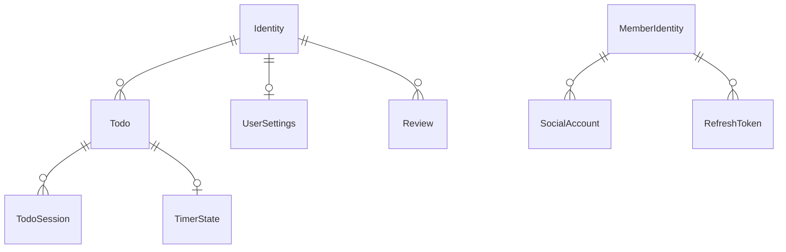
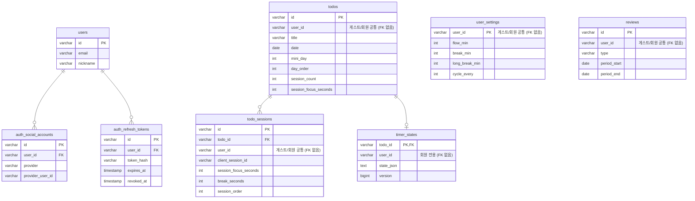

# FlowMate Data Model

> Last updated: 2026-03-28
>
> 관련 문서: [Architecture](architecture.md) · [API Reference](api.md)

## 1. 개념적 모델링

### 1) 핵심 개념

- Identity: 할 일, 회고, 설정을 소유하는 사용자 주체로 `회원`과 `게스트` 두 유형이 있다.
- MiniDay: 하루를 오전·오후·저녁 같은 시간 블록으로 나누어 Todo를 배치하기 위한 구간 개념이다.
- Todo: Identity가 특정 날짜와 MiniDay 구간에 계획하는 작업 단위이며, 필요하면 복습 체인 메타데이터를 함께 가진다.
- TodoSession: Todo를 수행하는 과정에서 발생하는 집중·휴식 기록 단위다.
- TimerState: 진행 중인 Todo의 타이머 진행 상태를 나타내는 런타임 상태다.
- UserSettings: Identity별 집중·휴식 길이와 MiniDay 구성을 담는 개인 설정이다.
- Review: Identity가 일정 기간을 돌아보며 남기는 회고 기록이다.
- SocialAccount: 회원 Identity가 외부 OAuth 계정과 연결하기 위한 연동 정보다.
- RefreshToken: 회원 Identity의 로그인 상태 유지를 위한 인증 갱신 수단이다.

### 2) 관계

- 회원 Identity 1 : N SocialAccount
- 회원 Identity 1 : N RefreshToken
- Identity 1 : N Todo
- Identity 1 : 0..1 UserSettings
- Identity 1 : N Review
- Todo 1 : N TodoSession
- Todo 1 : 0..1 TimerState

## 2. 논리적 모델링

### 1) 주요 내용

| 엔터티           | 식별자       | 주요 속성                                                                                                 | 핵심 규칙                                                                                                                                                                                         |
|---------------|-----------|-------------------------------------------------------------------------------------------------------|-----------------------------------------------------------------------------------------------------------------------------------------------------------------------------------------------|
| Todo          | `id`      | `user_id`, `title`, `date`, `mini_day`, `day_order`, `timer_mode`, `review_round`, `original_todo_id` | `timer_mode`는 `'stopwatch' \| 'pomodoro' \| null`만 허용하고, 날짜 이동 시에도 Todo identity는 유지되며, 복습 Todo는 `(user_id, original_todo_id, review_round)` 유일 제약을 가지며, 세션 집계 필드는 캐시이고 정본은 `todo_sessions`다. |
| TodoSession   | `id`      | `todo_id`, `user_id`, `client_session_id`, `session_order`, `session_focus_seconds`, `break_seconds`  | Todo의 정본 세션이며 `(todo_id, client_session_id)`와 `(todo_id, session_order)`에는 유일 제약이 있고, 멱등 재요청에서는 `break_seconds`만 증가 방향으로 갱신된다.                                                                |
| TimerState    | `todo_id` | `user_id`, `state_json`, `version`                                                                    | Todo당 최대 1개만 존재하는 회원 전용 런타임 스냅샷이며, `state_json = null`은 행 삭제 대신 상태만 남기는 논리 삭제를 뜻하고 `version`은 단조 증가한다.                                                                                        |
| UserSettings  | `user_id` | `flow_min`, `break_min`, `long_break_min`, `cycle_every`                                              | 사용자당 최대 1개이며 평면 컬럼으로 저장하고 행이 없을 때는 서비스가 기본값으로 응답한다.                                                                                                                                           |
| Review        | `id`      | `user_id`, `type`, `period_start`, `period_end`                                                       | `(user_id, type, period_start)`에는 유일 제약이 있고 주간은 월요일 시작, 월간은 1일 시작 규칙을 따른다.                                                                                                                    |
| User          | `id`      | `email`, `nickname`                                                                                   | 회원 계정 엔터티다.                                                                                                                                                                                   |
| SocialAccount | `id`      | `user_id`, `provider`, `provider_user_id`                                                             | 회원 계정에 연결된 OAuth 계정이며 `(provider, provider_user_id)`에는 유일 제약이 있고 현재 구현 공급자는 `kakao`다.                                                                                                         |
| RefreshToken  | `id`      | `user_id`, `token_hash`, `expires_at`, `revoked_at`                                                   | 회원 전용 인증 토큰 저장소이며 평문 대신 해시만 저장하고 `token_hash`에는 유일 제약을 둔다.                                                                                                                                    |

### 2) 공통 규칙

- `todos`, `todo_sessions`, `user_settings`, `reviews`의 `user_id`는 게스트/회원 공통 식별자다.
- 위 핵심 테이블의 `user_id`는 `users.id` FK가 아니다.
- `auth_social_accounts`, `auth_refresh_tokens`만 `users.id`를 FK로 참조한다.
- `timer_states`는 회원 전용 서버 상태다. 게스트 타이머는 서버 저장 대상이 아니다.

### 3) 논리 ERD

표기: `MemberIdentity`는 `Identity` 중 회원 유형이며 별도 저장 엔터티가 아니다.



## 3. 물리적 모델링

기준 스키마: `backend/src/main/resources/db/migration/`

### 1) 핵심 테이블

```sql
CREATE TABLE todos
(
    id                    VARCHAR(36) PRIMARY KEY,
    user_id               VARCHAR(36)  NOT NULL,           -- 게스트/회원 공통 식별자 (JWT sub 기반)
    title                 VARCHAR(200) NOT NULL,
    note                  TEXT,
    date                  DATE         NOT NULL,
    mini_day              INT          NOT NULL DEFAULT 0, -- 0~3
    day_order             INT          NOT NULL DEFAULT 0,
    is_done               TINYINT(1)   NOT NULL DEFAULT 0,
    session_count         INT          NOT NULL DEFAULT 0,
    session_focus_seconds INT          NOT NULL DEFAULT 0,
    timer_mode            VARCHAR(20),
    review_round          INT,
    original_todo_id      VARCHAR(36),
    created_at            TIMESTAMP    NOT NULL DEFAULT CURRENT_TIMESTAMP,
    updated_at            TIMESTAMP    NOT NULL DEFAULT CURRENT_TIMESTAMP ON UPDATE CURRENT_TIMESTAMP
);

CREATE INDEX idx_todos_user_order ON todos (user_id, date, mini_day, day_order, created_at);
CREATE UNIQUE INDEX uq_todos_review_round ON todos (user_id, original_todo_id, review_round);
CREATE INDEX idx_todos_original ON todos (user_id, original_todo_id);

CREATE TABLE todo_sessions
(
    id                    VARCHAR(36) PRIMARY KEY,
    todo_id               VARCHAR(36) NOT NULL,
    user_id               VARCHAR(36) NOT NULL, -- 게스트/회원 공통 식별자 (JWT sub 기반)
    client_session_id     VARCHAR(36) NOT NULL, -- 프론트 멱등 키
    session_focus_seconds INT         NOT NULL DEFAULT 0,
    break_seconds         INT         NOT NULL DEFAULT 0,
    session_order         INT         NOT NULL,
    created_at            TIMESTAMP   NOT NULL DEFAULT CURRENT_TIMESTAMP,
    updated_at            TIMESTAMP   NOT NULL DEFAULT CURRENT_TIMESTAMP ON UPDATE CURRENT_TIMESTAMP,

    CONSTRAINT fk_todo_sessions_todo
        FOREIGN KEY (todo_id) REFERENCES todos (id) ON DELETE CASCADE,
    CONSTRAINT uq_todo_sessions_order
        UNIQUE (todo_id, session_order),
    CONSTRAINT uq_todo_sessions_client_session
        UNIQUE (todo_id, client_session_id)
);

CREATE INDEX idx_sessions_user ON todo_sessions (user_id);

CREATE TABLE user_settings
(
    user_id            VARCHAR(36) PRIMARY KEY,
    flow_min           INT         NOT NULL DEFAULT 25,
    break_min          INT         NOT NULL DEFAULT 5,
    long_break_min     INT         NOT NULL DEFAULT 15,
    cycle_every        INT         NOT NULL DEFAULT 4,
    auto_start_break   TINYINT(1)  NOT NULL DEFAULT 0,
    auto_start_session TINYINT(1)  NOT NULL DEFAULT 0,
    day1_label         VARCHAR(50) NOT NULL DEFAULT '오전',
    day1_start_min     INT         NOT NULL DEFAULT 360,
    day1_end_min       INT         NOT NULL DEFAULT 720,
    day2_label         VARCHAR(50) NOT NULL DEFAULT '오후',
    day2_start_min     INT         NOT NULL DEFAULT 720,
    day2_end_min       INT         NOT NULL DEFAULT 1080,
    day3_label         VARCHAR(50) NOT NULL DEFAULT '저녁',
    day3_start_min     INT         NOT NULL DEFAULT 1080,
    day3_end_min       INT         NOT NULL DEFAULT 1440,
    updated_at         TIMESTAMP   NOT NULL DEFAULT CURRENT_TIMESTAMP ON UPDATE CURRENT_TIMESTAMP
);

CREATE TABLE reviews
(
    id           VARCHAR(36) PRIMARY KEY,
    user_id      VARCHAR(36) NOT NULL, -- 게스트/회원 공통 식별자 (JWT sub 기반)
    type         VARCHAR(20) NOT NULL,
    period_start DATE        NOT NULL,
    period_end   DATE        NOT NULL,
    content      TEXT        NOT NULL,
    created_at   TIMESTAMP   NOT NULL DEFAULT CURRENT_TIMESTAMP,
    updated_at   TIMESTAMP   NOT NULL DEFAULT CURRENT_TIMESTAMP ON UPDATE CURRENT_TIMESTAMP,

    CONSTRAINT uniq_reviews_user_period
        UNIQUE (user_id, type, period_start)
);

CREATE INDEX idx_reviews_user_period ON reviews (user_id, period_start);
```

### 2) 인증 테이블

```sql
CREATE TABLE users
(
    id         VARCHAR(36) PRIMARY KEY,
    email      varchar(255),
    nickname   varchar(100),
    created_at TIMESTAMP NOT NULL DEFAULT CURRENT_TIMESTAMP,
    updated_at TIMESTAMP NOT NULL DEFAULT CURRENT_TIMESTAMP ON UPDATE CURRENT_TIMESTAMP
);

CREATE TABLE auth_social_accounts
(
    id               VARCHAR(36) PRIMARY KEY,
    user_id          VARCHAR(36)  NOT NULL,
    provider         VARCHAR(20)  NOT NULL,
    provider_user_id VARCHAR(100) NOT NULL,
    created_at       TIMESTAMP    NOT NULL DEFAULT CURRENT_TIMESTAMP,

    CONSTRAINT fk_social_user
        FOREIGN KEY (user_id) REFERENCES users (id) ON DELETE CASCADE,
    CONSTRAINT uq_provider_user
        UNIQUE (provider, provider_user_id)
);

CREATE TABLE auth_refresh_tokens
(
    id         VARCHAR(36) PRIMARY KEY,
    user_id    VARCHAR(36)  NOT NULL,
    token_hash VARCHAR(255) NOT NULL,
    expires_at TIMESTAMP    NOT NULL,
    revoked_at TIMESTAMP,
    created_at TIMESTAMP    NOT NULL DEFAULT CURRENT_TIMESTAMP,

    CONSTRAINT fk_refresh_user
        FOREIGN KEY (user_id) REFERENCES users (id) ON DELETE CASCADE,
    UNIQUE INDEX uq_token_hash (token_hash)
);
```

### 3) 런타임 테이블

```sql
CREATE TABLE timer_states
(
    todo_id    VARCHAR(36)  NOT NULL PRIMARY KEY,
    user_id    VARCHAR(36)  NOT NULL,
    state_json TEXT         NULL,               -- idle 시 NULL (논리 삭제), 활성 상태면 JSON 저장
    version    BIGINT       NOT NULL DEFAULT 0, -- 단조 증가. max(now, lastVersion + 1)을 앱 서버가 계산
    updated_at TIMESTAMP(3) NOT NULL DEFAULT CURRENT_TIMESTAMP(3) ON UPDATE CURRENT_TIMESTAMP(3),
    created_at TIMESTAMP(3) NOT NULL DEFAULT CURRENT_TIMESTAMP(3),

    CONSTRAINT fk_timer_states_todo
        FOREIGN KEY (todo_id) REFERENCES todos (id) ON DELETE CASCADE
);

CREATE INDEX idx_timer_states_user ON timer_states (user_id, updated_at DESC);
```

### 4) 물리 ERD (FK 기준)

표기: 핵심 테이블의 `user_id`는 게스트/회원 공통 식별자이며 FK가 아니다.



## 4. 설계 근거

### 1) 핵심 테이블에 `users` FK를 두지 않은 이유

- 선택: `todos`, `todo_sessions`, `user_settings`, `reviews`의 `user_id`는 `users.id` FK가 아닌 게스트/회원 공통 문자열 식별자로 둔다.
- 이유: 게스트와 회원이 같은 Todo·Settings·Review 모델을 공유해야 하고, 게스트는 회원 행 없이도 동일한 도메인 흐름을 가져야 한다.
- 대안과 기각 이유: 게스트 전용 테이블을 따로 두거나 모든 핵심 테이블에 회원 FK를 강제하는 방식도 가능하지만, 데이터 경로가 이원화되어 API·서비스·조회 로직이 불필요하게 복잡해진다.

### 2) Todo 집계 필드 역정규화

- 선택: `session_count`, `session_focus_seconds`를 `todos`에 캐시성 집계 필드로 둔다.
- 이유: 목록 렌더링과 회고 계산은 Todo 단위 합계를 자주 읽기 때문에 매번 `todo_sessions`를 집계하는 비용을 줄일 수 있다.
- 대안과 기각 이유: 세션 테이블만 정본으로 두고 매 조회 시 합계를 계산할 수도 있지만, 읽기 비용이 커지고 목록·회고 응답 경로가 무거워져 현재 사용 패턴에 비해 비효율적이다.

### 3) `state_json` 논리 삭제와 `version` 단조성 보장

- 선택: idle 전환 시 `timer_states` 행을 삭제하지 않고 `state_json = NULL`로 남기며, `version`은 계속 단조 증가시킨다.
- 이유: 타이머 상태는 최신성 비교가 중요하므로 행을 유지해야 다른 탭·기기와의 동기화에서 이전 상태보다 확실히 새로운 값을 구분할 수 있다.
- 대안과 기각 이유: idle 때 행을 삭제하면 저장소는 단순해지지만, 다음 삽입/갱신에서 `version`이 초기화되어 새 상태가 오래된 상태로 오판될 위험이 있다.
