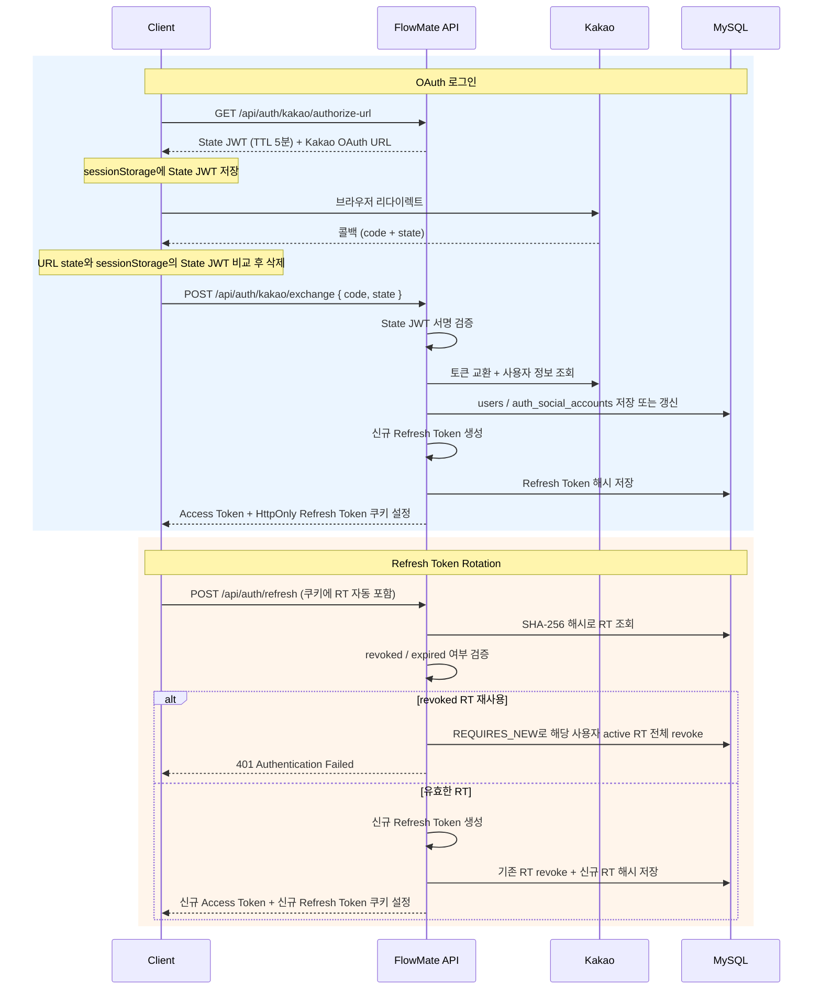

# X-Client-Id에서 OAuth + RTR까지 인증 시스템 발전시키기

## 요약

- 문제: 초기 `X-Client-Id`는 서명도 TTL도 없는 브라우저 입력값으로, 사용자 신원 증명 불가
- 해결: 게스트 연속성과 회원 보안을 모두 만족하는 이중 인증 구조 — Guest JWT + Memory AT + HttpOnly RT + RTR
- 결과: 4단계 진화(X-Client-Id → Guest JWT → OAuth + RTR → Reuse Detection)를 거쳐 토큰 탈취 대응 구축

## 1. 문제 배경 — X-Client-Id의 한계

초기 MVP는 백엔드 없이 localStorage만으로 데이터를 관리하며 제품 흐름을 먼저 검증하는 것이 목표였다.

이후 백엔드가 도입되면서 인증 요구사항이 생겼고, 네 번의 큰 변화를 거쳤다.

| Phase   | 시점                    | 핵심 변화                                                        |
|---------|-----------------------|--------------------------------------------------------------|
| Phase 1 | 2026-01-09~2026-02-21 | 백엔드 없는 프론트 MVP → `X-Client-Id` 기반 API 식별                     |
| Phase 2 | 2026-02-27            | 로그인 도입: JWT + Kakao OAuth, memory AT, HttpOnly RT, State JWT |
| Phase 3 | 2026-03-01            | 다중 기기 로그인 + RTR                                              |
| Phase 4 | 2026-04-21~2026-04-25 | RTR 이후 revoke 정책 및 Reuse Detection 명시화                       |

## 2. 보안 고려사항

인증 설계에서 고려한 위협과 각 Phase에서의 대응은 다음과 같다.

| 위협                    | 경로                       | 대응                                  |
|-----------------------|--------------------------|-------------------------------------|
| XSS로 Access Token 탈취  | 악성 스크립트가 localStorage 읽기 | Memory 저장 (localStorage 미사용)        |
| CSRF로 인가되지 않은 요청      | 외부 사이트에서 쿠키 자동 전송        | SameSite=Lax + `Path=/api/auth`     |
| OAuth callback 위조     | 공격자가 만든 redirect URL로 유도 | State JWT 서명 검증 + sessionStorage 비교 |
| Refresh Token 원문 유출   | DB 탈취 후 RT 원문으로 재발급      | HttpOnly cookie + SHA-256 hash만 저장  |
| 탈취된 Refresh Token 재사용 | 탈취 후 지속 재발급              | RTR + Reuse Detection (revoke-all)  |

## 3. Phase 1 — X-Client-Id 기반 게스트 식별

| 구분 | 내용                                                        |
|----|-----------------------------------------------------------|
| 요구 | 로그인 없이 Todo와 타이머 기능을 먼저 검증                                |
| 결정 | localStorage/MSW MVP → 백엔드 도입 후 `X-Client-Id` 헤더로 게스트 식별  |
| 결과 | 빠른 제품 검증은 가능했지만, 서명/TTL 없는 브라우저 입력값을 장기 인증 모델로 쓰기엔 한계가 명확 |

프론트엔드가 브라우저 UUID를 localStorage에 저장하고 `X-Client-Id` 헤더로 보냈다. 백엔드는 UUID 형식만 검증했다.

복잡한 서버 세션이나 OAuth 없이 사용자별 데이터를 나눌 수 있어 초기 MVP에선 합리적이었다. 다만 백엔드가 검증하는 것은 사용자의 신원이 아니라 브라우저가 보낸 문자열뿐이었다. 서명도 TTL도 없고 요청자가
바꿀 수 있다는 점에서, `X-Client-Id`는 장기 인증 모델이 아닌 임시 식별자에 가까웠다.

## 4. Phase 2 — 게스트/회원 이중 인증 도입

| 구분 | 내용                                                     |
|----|--------------------------------------------------------|
| 요구 | 게스트와 회원을 구분하고, Kakao OAuth 로그인 후 회원 세션 유지              |
| 결정 | Guest/Member JWT 분리, Memory AT, HttpOnly RT, State JWT |
| 결과 | 서명된 token으로 사용자를 검증하고, 장기 token 노출 위험을 줄이는 구조로 변경      |

Spring Security OAuth2 Client도 검토했지만, OAuth 흐름을 직접 이해하기 위해 수동 구현을 선택했다. Provider가 늘어나는 시점에 재검토 예정.

### 토큰 정책

| 토큰                | 저장 위치                           | TTL | 판단                              |
|-------------------|---------------------------------|-----|---------------------------------|
| Guest JWT         | `localStorage`                  | 90일 | XSS 위험보다 재방문 연속성 우선             |
| Member Access JWT | 브라우저 메모리                        | 15분 | 장기 보관 token의 XSS 노출 위험 완화       |
| State JWT         | `sessionStorage`, callback 후 삭제 | 5분  | 서버 저장소 없이 서명만으로 OAuth CSRF 방어   |
| Refresh Token     | HttpOnly cookie                 | 14일 | JS 접근 차단, 서버에는 SHA-256 hash만 저장 |

## 5. Phase 3 — 다중 기기 로그인과 RTR

| 구분 | 내용                                                 |
|----|----------------------------------------------------|
| 요구 | SSE 도입으로 PC·모바일·여러 탭에서 같은 계정을 동시에 유지 필요            |
| 결정 | login 시 기존 active RT 유지, refresh 성공 시 현재 token만 회전 |
| 결과 | 기기별 RT chain이 생기고, 새 기기 로그인이 기존 기기를 끊지 않게 됨        |

타이머 [SSE 동기화](sse-sync.md) 도입으로 다중 기기 세션이 필요해졌다. login 시 기존 active RT를 전체 revoke하면 정책은 단순하지만, PC 로그인 중 모바일에서 로그인하면 PC가
의도치 않게 로그아웃된다. "새 기기 로그인 = 기존 기기 종료"는 SSE 동기화 목표와 충돌하므로 기기별 RT chain 유지를 선택했다.

정상 흐름은 이렇게 된다.

```text
기기 A: RT-A1로 /api/auth/refresh
서버:  RT-A1 revoke
서버:  RT-A2 발급 + cookie 교체

기기 B: RT-B1로 /api/auth/refresh
서버:  RT-B1 revoke
서버:  RT-B2 발급 + cookie 교체
```

각 기기는 자신만의 refresh token chain을 가진다. Refresh Token Rotation은 장기 refresh token 하나가 계속 재사용되는 기간을 줄이고, 폐기된 token이 나중에 다시
들어왔을 때 이상 신호로 볼 수 있다.

## 6. Phase 4 — Reuse Detection

| 구분 | 내용                                                                |
|----|-------------------------------------------------------------------|
| 요구 | 다중 기기 로그인과 RTR을 유지하면서, login/refresh/logout/reuse 상황의 폐기 의미를 분리   |
| 결정 | login은 기존 active RT를 유지하고, revoked RT 재사용에서만 active RT 전체를 revoke |
| 결과 | 새 기기 로그인이 기존 기기를 끊지 않고, 폐기된 token 재사용은 탈취 의심 신호로 처리               |

Phase 3의 다중 기기 + RTR만으로는 모든 revoke 경로가 설명되지 않았다. 특히 새 로그인이 기존 세션을 끊는 경로와, 폐기된 token이 다시 들어오는 경로는 다르게 다뤄야 했다.

[RefreshToken.java](../../backend/src/main/java/kr/io/flowmate/auth/domain/RefreshToken.java)에서 token 상태를 다음과 같이 표현한다.

```text
isValid(): revokedAt == null && expiresAt > now
isStolenReuse(): revokedAt != null
revoke(): revokedAt = now
```

현재 revoke 정책은 경로별로 나뉜다.

| 경로             | 현재 revoke 정책                | 의미          |
|----------------|-----------------------------|-------------|
| login          | 기존 active RT 유지, 새 RT 추가 발급 | 다중 기기 세션 허용 |
| refresh 성공     | 현재 RT revoke, 새 RT 발급       | RTR 정상 회전   |
| revoked RT 재사용 | active RT 전체 revoke         | 탈취 의심 대응    |
| logout         | 현재 cookie의 RT만 revoke       | 현재 세션 종료    |

## 7. 현재 인증 흐름

현재 인증은 주요 6가지 경로로 구성된다. OAuth login과 RTR의 상세 흐름은 아래 시퀀스 다이어그램에서 확인할 수 있다.

| 경로                         | 핵심 동작                                                              |
|----------------------------|--------------------------------------------------------------------|
| Guest start                | `POST /api/auth/guest/token` → Guest JWT 발급 → localStorage 저장      |
| OAuth login                | State JWT 발급 → Kakao 인가 → code 교환 → AT(body) + RT(HttpOnly cookie) |
| Refresh (RTR)              | RT cookie 자동 전송 → 기존 RT revoke → 새 RT + AT 발급                      |
| Page load (silent refresh) | authMode 힌트 확인 → member면 자동 refresh → 실패 시 게스트 폴백 없이 로그인 유도        |
| API 401 refresh 실패         | 회원 refresh 실패 → member 세션 종료 → 게스트 토큰 재시도 없이 로그인 유도                |
| Logout                     | 현재 RT만 revoke → cookie 삭제 → 게스트 전환                                 |



## 8. 트레이드오프

| 결정                   | 얻은 것                    | 감수한 비용                    |
|----------------------|-------------------------|---------------------------|
| AT memory 저장         | XSS 노출 위험 완화            | 새로고침 시 소실, refresh로 복구    |
| RT HttpOnly cookie   | JS 직접 접근 차단             | CSRF 고려 필요 (SameSite=Lax) |
| RT hash 저장 (SHA-256) | DB 유출 시 원문 재사용 방지       | refresh마다 hash 조회         |
| RTR                  | RT 장기 재사용 위험 축소         | 클라이언트 refresh 동시성 관리 필요   |
| Reuse Detection      | 폐기된 RT 재사용을 탈취 신호로 활용   | 지연 요청 오탐 가능성              |
| State JWT            | 서버 저장소 없이 OAuth CSRF 방어 | 1회 사용 보장 불가 (stateless)   |

## 9. 회고

### 단계적 발전으로 복잡도를 감당할 수 있었다

처음부터 OAuth, JWT, HttpOnly cookie, RTR, 다중 기기 세션, Reuse Detection을 모두 갖춘 인증 시스템을 만들려 했다면 높은 복잡도로 시작도 못했을 것이다.

그러나 X-Client-Id → Guest JWT → OAuth → RTR 순서로 단계를 나눠 진행하면서, 각 단계에서 무엇이 부족하고 어떤 위험이 생기는지 확인할 수 있었다. 처음부터 100점을 목표로 하지
않았기에 오히려 각 선택의 필요성과 한계를 더 명확하게 파악할 수 있었다.

### 직접 구현으로 원리를 이해했지만, 라이브러리 도입은 검토 대상이다

Spring Security OAuth2 Client를 처음부터 붙였다면 내부적으로 어떻게 동작하는지 원리를 이해하기 어려웠을 것이다. 직접 State JWT를 만들고, Kakao code를 교환하고, AT/RT
저장 위치를 나누고, RTR과 Reuse Detection을 구현하면서 각 단계가 왜 필요한지 구체적으로 이해할 수 있었다.

다만 실무에서는 대부분 표준 라이브러리를 통해 구현하므로, Provider가 늘어나거나 운영 규모가 커지는 시점에 Spring Security 도입을 검토해야 하고, 추후 리팩토링을 통해 도입할 예정이다.

### State JWT의 1회 사용 보장과 RT 만료 관리는 Redis로 개선할 수 있다

현재 State JWT는 stateless라 서버가 state를 저장하지 않아 1회 사용 보장과 즉시 무효화가 불가능하다. 5분 TTL 안에서 replay가 이론적으로 가능한데, 공격자가 state를 가로채려면 이미
세션을 탈취한 상태이므로 현재 규모에서 실 위험은 낮다.

RT는 MySQL `auth_refresh_tokens`에 저장하고, `expires_at`으로 만료 여부를 검증한다. 만료된 RT를 물리 삭제하는 배치는 아직 없다. cleanup batch를 두거나 Redis TTL 기반 저장소로 옮기면 State JWT의 1회 사용 보장과 RT 만료 자동 처리를 함께 해결할 수 있다.
