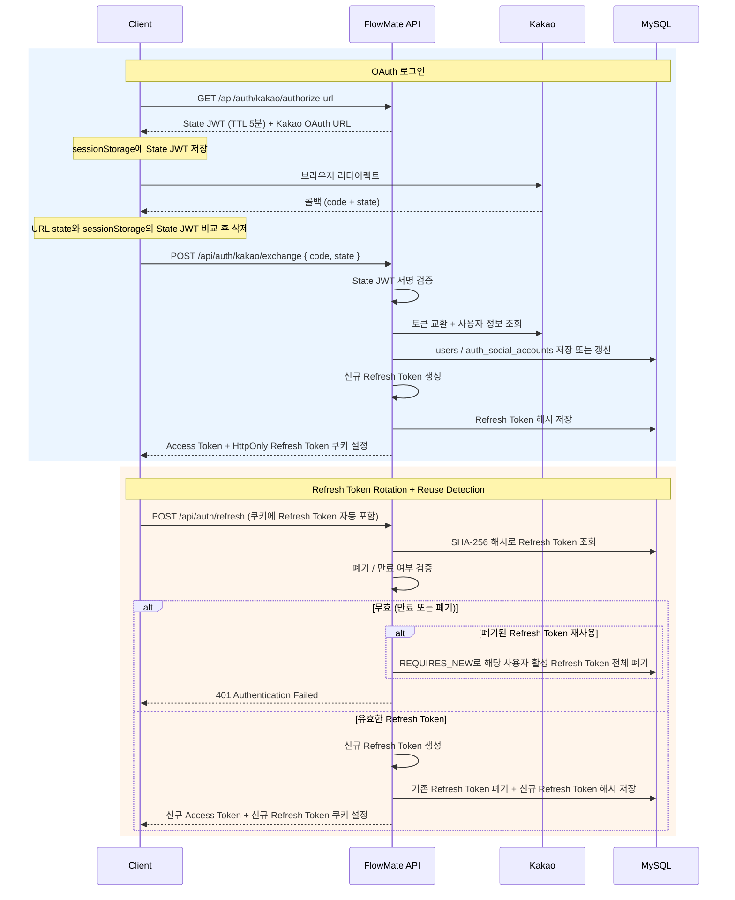

# 임시 식별자에서 토큰 탈취 대응까지: 인증 구조 4단계 진화

> 관련 문서: [폐기된 Refresh Token 재사용 시 활성 RT 즉시 무효화: revoke-all 트랜잭션 분리](auth-reuse-detection-rollback.md)

## 요약

**문제**: 초기 `X-Client-Id`는 서명과 만료 없이 **클라이언트가 보낸 UUID 형식만 검증**해, 사용자가 값을 바꿔도 신원 증명이 불가능

**해결**: 게스트와 회원 모두 JWT로 인증하고, 회원 로그인은 OAuth, 갱신은 기기별 **Refresh Token Rotation과 재사용 탐지**로 구현

**결과**: 게스트와 회원 모두 서명된 토큰으로 신원을 검증하고, **새 기기 로그인은 기존 세션을 유지**하며 **탈취된 토큰 재사용에는 즉시 대응**

## 1. 문제 배경: X-Client-Id의 한계

초기 MVP는 백엔드 없이 localStorage만으로 데이터를 관리하며 제품 흐름을 먼저 검증하는 것이 목표였다.

이후 요구사항에 따라 네 번의 큰 변화를 거쳤다.

| Phase   | 시점                | 핵심 변화                                   |
|---------|-------------------|-----------------------------------------|
| Phase 1 | 26-01-09~26-02-21 | 백엔드 없는 프론트 MVP: `X-Client-Id` 기반 게스트 식별 |
| Phase 2 | 26-02-27          | 로그인 도입: 게스트/회원 JWT 분리 + Kakao OAuth     |
| Phase 3 | 26-03-01          | 멀티디바이스 지원: Refresh Token Rotation 도입    |
| Phase 4 | 26-04-21~26-04-25 | Refresh Token 탈취 대응: Reuse Detection 도입 |

## 2. 보안 고려사항

인증 설계에서 고려한 위협과 각 Phase에서의 대응은 다음과 같다.

| 위협                    | 경로                   | 대응                                  |
|-----------------------|----------------------|-------------------------------------|
| 게스트 식별자 변조            | localStorage 조작      | 서명+TTL Guest JWT                    |
| Access Token 탈취       | XSS로 localStorage 읽기 | 브라우저 메모리 저장(localStorage 미사용)       |
| CSRF                  | 쿠키 자동 전송             | SameSite=Lax                        |
| OAuth callback 위조     | redirect URL 위조      | State JWT 서명 검증 + sessionStorage 비교 |
| Refresh Token 원문 유출   | DB 유출 시 재구성 시도       | SHA-256 hash만 저장(원문 재구성 불가)         |
| 탈취된 Refresh Token 재사용 | 탈취 후 재사용 시도          | RTR + Reuse Detection               |

## 3. Phase 1: X-Client-Id 기반 게스트 식별

| 구분 | 내용                                                        |
|----|-----------------------------------------------------------|
| 요구 | 로그인 없이 Todo와 타이머 기능을 먼저 검증                                |
| 결정 | localStorage/MSW MVP -> 백엔드 도입 후 `X-Client-Id` 헤더로 게스트 식별 |
| 결과 | 빠른 제품 검증은 가능했지만, 서명/TTL 없는 브라우저 입력값을 장기 인증 모델로 쓰기엔 한계가 명확 |

프론트엔드가 브라우저 UUID를 localStorage에 저장하고 `X-Client-Id` 헤더로 보냈다. 백엔드는 UUID 형식만 검증했다.

복잡한 서버 세션이나 OAuth 없이 사용자별 데이터를 나눌 수 있어 초기 MVP에선 합리적이었다. 다만 신원 증명이 아니라 형식 검증에 불과해, 다른 사용자의 UUID를 그대로 헤더에 넣으면 그 사용자인 것처럼 요청할 수 있었다.

## 4. Phase 2: 게스트/회원 JWT 분리 도입

| 구분 | 내용                                                                         |
|----|----------------------------------------------------------------------------|
| 요구 | 게스트와 회원을 구분하고, Kakao OAuth 로그인 후 회원 세션 유지                                  |
| 결정 | 게스트/회원 JWT 분리, Access Token은 메모리, Refresh Token은 HttpOnly 쿠키, State JWT 도입 |
| 결과 | 서명된 token으로 사용자를 검증하고, 장기 token 노출 위험을 줄이는 구조로 변경                          |

세션 기반 인증도 검토했지만, 게스트와 회원을 하나의 웹앱에서 동일한 방식으로 인증해야 했고, 서버 세션 상태에 의존하지 않아 향후 서버를 여러 대로 늘려도 세션 동기화 부담이 없다는 점에서 JWT를 선택했다.

Spring Security OAuth2 Client도 검토했지만, OAuth 흐름을 직접 이해하기 위해 수동 구현을 선택했다.

### 토큰 정책

| 토큰            | 저장 위치            | TTL | 판단                             |
|---------------|------------------|-----|--------------------------------|
| Guest JWT     | `localStorage`   | 90일 | XSS 위험보다 재방문 연속성 우선            |
| Access Token  | 브라우저 메모리         | 15분 | 장기 보관 시 XSS 노출 위험 완화           |
| State JWT     | `sessionStorage` | 5분  | 서명 검증 + 브라우저 바인딩으로 CSRF 방어     |
| Refresh Token | HttpOnly cookie  | 14일 | JS 접근 차단, 서버엔 SHA-256 hash만 저장 |

## 5. Phase 3: 멀티디바이스 로그인과 Refresh Token Rotation

| 구분 | 내용                                                           |
|----|--------------------------------------------------------------|
| 요구 | SSE 도입으로 데스크톱, 모바일 등 다른 브라우저에서도 같은 계정을 동시에 유지 필요             |
| 결정 | 로그인 시 기존 활성 Refresh Token 유지, refresh 성공 시 현재 token만 회전      |
| 결과 | 브라우저별 Refresh Token chain이 생기고, 새 브라우저 로그인이 기존 브라우저를 끊지 않게 됨 |

타이머 [SSE 동기화](sse-sync.md) 도입으로 멀티디바이스 세션이 필요해졌다. 그전까지는 로그인마다 기존 활성 Refresh Token을 모두 폐기하고 새로 발급했는데, 이 정책은 단순하지만 데스크톱 로그인 중 모바일에서 로그인하면 데스크톱이 의도치 않게 로그아웃된다.

따라서 "새 기기 로그인 = 기존 기기 종료"는 SSE 동기화 목표와 충돌하므로, 로그인 시 기존 브라우저의 Refresh Token을 유지하도록 바꿨다.

정상 흐름은 다음과 같다.

```text
브라우저 A: RT-A1로 /api/auth/refresh
서버:      RT-A1 revoke
서버:      RT-A2 발급 + cookie 교체

브라우저 B: RT-B1로 /api/auth/refresh
서버:      RT-B1 revoke
서버:      RT-B2 발급 + cookie 교체
```

각 브라우저는 자신만의 refresh token chain을 가진다. Refresh Token Rotation은 장기 refresh token 하나가 계속 재사용되는 기간을 줄이고, 폐기된 token이 나중에 다시 들어왔을 때 이상 신호로 볼 수 있다.

## 6. Phase 4: Reuse Detection

| 구분 | 내용                                                                        |
|----|---------------------------------------------------------------------------|
| 요구 | 멀티디바이스와 Refresh Token Rotation을 유지하며 login/refresh/logout/reuse의 폐기 의미 분리 |
| 결정 | 폐기된 Refresh Token 재사용 시에만 활성 Refresh Token 전체 폐기                          |
| 결과 | 폐기된 토큰 재사용은 탈취 신호로 처리되어 활성 Refresh Token 전체가 즉시 폐기됨                       |

기존의 멀티디바이스 + Refresh Token Rotation만으로는 모든 폐기 경로가 설명되지 않았다. 실제로 이전 코드는 폐기된 Refresh Token이 재사용돼도 만료된 경우와 구분 없이 같은 400 오류만 반환했다. 이 재사용 경로를 단순 만료와 다르게 다뤄야 했다.

[RefreshToken.java](../../backend/src/main/java/kr/io/flowmate/auth/domain/RefreshToken.java)에서 token 상태를 다음과 같이 표현한다.

```text
isValid(): revokedAt == null && expiresAt > now
isStolenReuse(): revokedAt != null
revoke(): revokedAt = now
```

결론적으로 현재 폐기 정책은 경로별로 나뉜다.

| 경로                | 현재 폐기 정책                                 | 의미              |
|-------------------|------------------------------------------|-----------------|
| login             | 기존 Refresh Token 유지 + 새 Refresh Token 발급 | 멀티디바이스 세션 허용    |
| refresh 성공        | 현재 Refresh Token 폐기, 새 Refresh Token 발급  | 정상 회전           |
| 만료된 Refresh Token | 토큰 상태 변경 없이 401 반환                       | 정상 만료 처리(탈취 아님) |
| 폐기 토큰 재사용         | 활성 Refresh Token 전체 폐기                   | 탈취 의심 대응        |
| logout            | 현재 cookie의 Refresh Token만 폐기             | 현재 세션 종료        |

## 7. 현재 인증 흐름

현재 인증은 주요 7가지 경로로 구성된다.

| 경로                         | 핵심 동작                                                                                      |
|----------------------------|--------------------------------------------------------------------------------------------|
| Guest start                | `POST /api/auth/guest/token` -> Guest JWT 발급 -> localStorage 저장                            |
| OAuth login                | State JWT 발급 -> Kakao 인가 -> code 교환 -> Access Token(body) + Refresh Token(HttpOnly cookie) |
| Refresh Token Rotation     | Refresh Token cookie 자동 전송 -> 기존 Refresh Token 폐기 -> 새 Refresh Token + Access Token 발급     |
| Reuse Detection            | 폐기된 Refresh Token 재사용 감지 -> 해당 사용자 활성 Refresh Token 전체 폐기 -> 401 응답                        |
| Page load (silent refresh) | authMode 힌트 확인 -> member면 자동 refresh -> 실패 시 게스트 폴백 없이 로그인 유도                              |
| API 401 refresh 실패         | 회원 refresh 실패 -> member 세션 종료 -> 게스트 토큰 재시도 없이 로그인 유도                                      |
| Logout                     | 현재 Refresh Token만 폐기 -> cookie 삭제 -> 게스트 전환                                                |



## 8. 트레이드오프

| 결정                              | 얻은 것                             | 감수한 비용                         |
|---------------------------------|----------------------------------|--------------------------------|
| Access Token memory 저장          | XSS 노출 위험 완화                     | 새로고침 시 소실, refresh로 복구         |
| Refresh Token HttpOnly cookie   | JS 직접 접근 차단                      | CSRF 고려 필요 (SameSite=Lax)      |
| Refresh Token hash 저장 (SHA-256) | DB 유출 시 원문 재사용 방지                | 저장된 원문을 다시 확인·복구할 수 없음         |
| Refresh Token Rotation          | Refresh Token 장기 재사용 위험 축소       | 서버 측 동시 refresh 경합 미해결(알려진 한계) |
| Reuse Detection                 | 폐기된 Refresh Token 재사용을 탈취 신호로 활용 | 지연 요청 오탐 가능성                   |
| State JWT                       | 서버 저장소 없이 OAuth CSRF 방어          | 1회 사용 보장 불가 (stateless)        |

## 9. 회고

### 단계적 발전으로 복잡도를 감당할 수 있었다

처음부터 OAuth, JWT, HttpOnly cookie, Refresh Token Rotation, 멀티디바이스 세션, Reuse Detection을 모두 갖춘 인증 시스템을 만들려 했다면 높은 복잡도로 시작도 못했을 것이다.

그러나 X-Client-Id -> Guest/Member JWT -> Refresh Token Rotation -> Reuse Detection 순서로 단계를 나눠 진행하면서, 각 단계에서 무엇이 부족하고 어떤 위험이 생기는지 확인할 수 있었다. 처음부터 완벽을 목표로 하지 않았기에 오히려 각 선택의 필요성과 한계를 더 명확하게 파악할 수 있었다.

### 직접 구현으로 원리를 이해했지만, 라이브러리 도입은 검토 대상이다

Spring Security OAuth2 Client를 처음부터 붙였다면 내부적으로 어떻게 동작하는지 원리를 이해하기 어려웠을 것이다. 직접 State JWT를 만들고, Kakao code를 교환하고, Access Token/Refresh Token 저장 위치를 나누고, Refresh Token Rotation과 Reuse Detection을 구현하면서 각 단계가 왜 필요한지 구체적으로 이해할 수 있었다.

다만 실무에서는 대부분 표준 라이브러리를 통해 구현하므로, Provider가 늘어나거나 운영 규모가 커지는 시점에 Spring Security 도입을 재검토할 예정이다.
