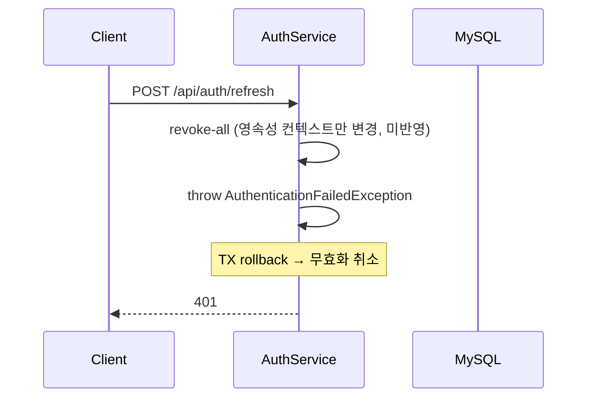
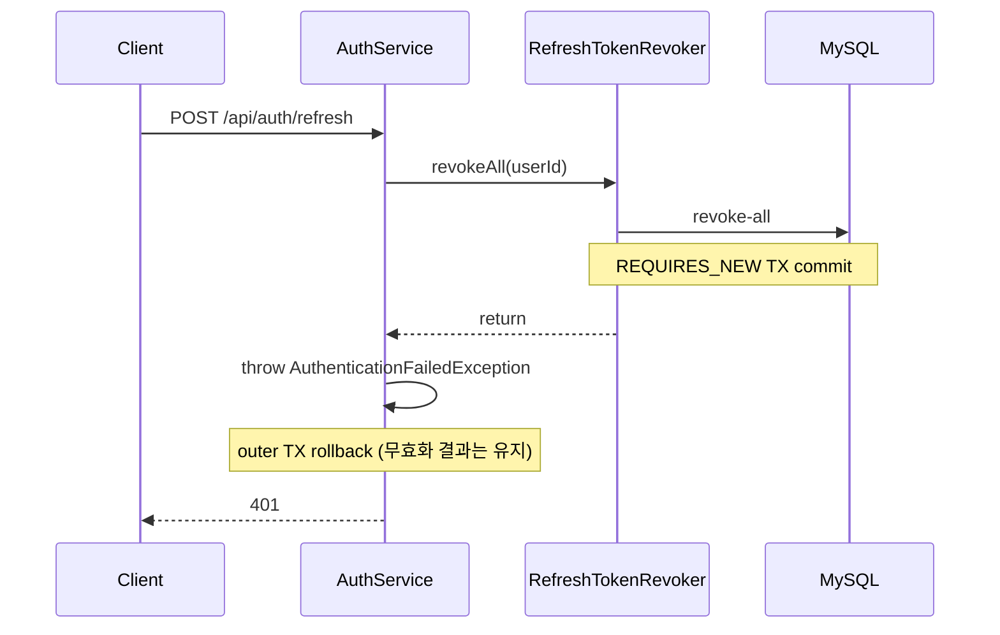

# 폐기된 Refresh Token 재사용 시 활성 RT 즉시 무효화: revoke-all 트랜잭션 분리

> 관련 문서: [임시 식별자에서 토큰 탈취 대응까지: 인증 구조 4단계 진화](auth-evolution.md)

## 요약

**문제**: 폐기된 RT 재사용 요청은 401로 차단됐지만, 같은 트랜잭션에서 실행한 **revoke-all이 예외와 함께 롤백**되어 DB에 반영되지 않음

**해결**: revoke-all을 별도 Bean의 **`REQUIRES_NEW` 트랜잭션**으로 분리해 실패 응답과 무관하게 먼저 커밋하고, **복합 인덱스**로 조회 성능까지 개선

**결과**: 폐기된 RT 재사용 시 활성 RT 전체가 즉시 무효화되고, 로그아웃 전환까지 검증, 조회 행 100,000건 -> 1,000건까지 최적화

## 1. 문제 배경

FlowMate는 RTR(Refresh Token Rotation)과 Reuse Detection을 사용해 다음과 같은 방식으로 동작한다. refresh가 성공할 때마다 기존 RT를 폐기하고 새 RT를 발급한다. 따라서 이미 폐기된 RT가 다시 사용되는 경우, 정상적인 클라이언트 흐름이 아니라 탈취된 토큰의 재사용 가능성으로 보고 같은 사용자의 활성 RT 전체를 무효화한다.

`auth-evolution.md` 문서를 다시 점검하고 업데이트하면서, 실제 운영 환경에서도 의도한 대로 동작하는지 브라우저를 통해 각 인증 경로를 검증했다. 그 결과, login, refresh, logout 경로는 모두 의도대로 동작했다. 그러나 폐기된 RT를 재사용하는 경로에서는 401 응답만 반환되고, 같은 사용자의 활성 RT가 DB에 그대로 남아 있었다.

즉, 요청 자체는 인증 실패로 차단됐지만 Reuse Detection의 핵심 조치인 전체 토큰 무효화(revoke-all)는 실제 DB에 반영되지 않았고, 그 결과 다른 디바이스의 세션도 유지된 상태였다.

## 2. 원인: revoke-all이 같은 트랜잭션에서 롤백됨

수정 전 `refresh()` 메서드의 Reuse Detection 경로는 다음과 같았다.

```java
@Transactional
public LoginResponse refresh(...) {
    // ...
    if (!refreshToken.isValid()) {
        if (refreshToken.isStolenReuse()) {
            refreshTokenRepository.findAllActiveByUserId(refreshToken.getUserId(), Instant.now())
                    .forEach(RefreshToken::revoke);
        }
        throw new AuthenticationFailedException("만료 또는 폐기된 Refresh Token");
    }
    // ...
}
```

코드만 보면 폐기된 RT가 재사용됐을 때 같은 사용자의 활성 RT 전체를 무효화하는 것처럼 보인다. 문제는 revoke-all에 따른 DB 상태 변경이
`refresh()`를 감싸는 트랜잭션 안에서 처리된 뒤, 곧바로
`AuthenticationFailedException`이 발생한다는 점이었다.

`AuthenticationFailedException`은
`RuntimeException`을 상속하는 unchecked exception이며, Spring의 선언적 트랜잭션은 기본적으로 unchecked exception 발생 시 현재 트랜잭션을 롤백한다.

`forEach(RefreshToken::revoke)`는 영속성 컨텍스트의 엔티티만 변경할 뿐, flush를 트리거하는 쿼리가 그 사이에 없어 UPDATE가 DB로 전송되지도 않았을 수 있다. 예외와 함께
`refresh()` 트랜잭션 전체가 롤백되면서 어느 경우든 DB에는 반영되지 않았다.

### 단위 테스트에서 놓친 이유

단위 테스트는 mock repository가 반환한 엔티티의 메모리 상태만 확인한다. 따라서
`revoke()`가 호출됐는지는 검증할 수 있지만, 예외 발생 후 트랜잭션이 롤백될 때 DB row에 실제로 반영되는지까지는 확인할 수 없다.

즉, 이번 버그는 비즈니스 분기가 아니라 트랜잭션 경계의 문제였기 때문에 단위 테스트만으로는 구조적으로 잡기 어려웠다.

## 3. 해결 방향

이번 문제의 핵심은 revoke-all이 실행되지 않은 것이 아니라, revoke-all에 따른 DB 상태 변경이 예외와 함께 같은 트랜잭션에서 롤백됐다는 점이었다. 따라서 해결 방향은 반드시 커밋되어야 하는 revoke-all을 기존
`refresh()` 트랜잭션 경계 밖으로 분리하는 것이었다.

이를 위해 revoke-all 로직에는 독립적인 트랜잭션이 필요했다. 앞서 본 unchecked exception 롤백 규칙 때문에, revoke-all이
`refresh()` 트랜잭션에 함께 묶여 있는 한 같은 문제가 반복될 수밖에 없다.

또한 `@Transactional`은 Spring AOP proxy를 통해 적용된다. 같은 클래스 내부에서
`REQUIRES_NEW`가 붙은 메서드를 직접 호출하는 self-invocation(자기 호출) 구조에서는 proxy를 거치지 않기 때문에 새 트랜잭션이 시작되지 않는다.

결론적으로, 해결 방향은 다음과 같이 정리했다.

- `AuthenticationFailedException`에 의한 outer 트랜잭션 롤백은 그대로 둔다.
- 롤백되면 안 되는 revoke-all의 DB 상태 변경은 `REQUIRES_NEW` 트랜잭션으로 분리한다.
- `REQUIRES_NEW`가 실제 적용되도록 revoke-all 메서드를 별도 Bean으로 분리해 Spring proxy를 거치게 한다.

## 4. 해결: revoke-all을 독립 트랜잭션으로 분리

revoke-all을 담당하는 별도 Bean을 만들고, 해당 메서드에 `REQUIRES_NEW` 트랜잭션을 적용했다.

```java
@Service
@RequiredArgsConstructor
public class RefreshTokenRevoker {

    private final RefreshTokenRepository refreshTokenRepository;

    @Transactional(propagation = Propagation.REQUIRES_NEW)
    public void revokeAll(String userId) {
        refreshTokenRepository.revokeAllActiveByUserId(userId, Instant.now());
    }
}
```

`AuthService.refresh()`는 폐기된 RT 재사용이 감지되면 revoke-all을 `RefreshTokenRevoker`에 위임한다.

```java
if (!refreshToken.isValid()) {
    if (refreshToken.isStolenReuse()) {
        refreshTokenRevoker.revokeAll(refreshToken.getUserId());
    }
    throw new AuthenticationFailedException("만료 또는 폐기된 Refresh Token");
}
```

결과적으로 `RefreshTokenRevoker`의 `REQUIRES_NEW` 트랜잭션이 먼저 커밋된다. 이후 `AuthService.refresh()`에서
`AuthenticationFailedException`이 발생해 outer 트랜잭션이 롤백되더라도, 이미 커밋된 revoke-all 결과는 유지된다.

### 트랜잭션 경계: Before / After

#### Before: revoke-all이 outer TX에 묶인 상태 (폐기된 RT 재사용 경로만 표현)



#### After: revoke-all을 REQUIRES_NEW로 분리 (폐기된 RT 재사용 경로만 표현)



## 5. 검증

### 5.1 통합 테스트

`AuthServiceIT`는 Spring Context, 트랜잭션 프록시, JPA repository, H2 DB를 사용해 예외 발생 이후의 DB 상태를 직접 조회한다. 이번 문제는 단순히 메서드 호출 여부가 아니라 트랜잭션 커밋 여부가 핵심이었기 때문에, 실제 Spring 트랜잭션 경계 안에서 검증할 필요가 있었다.

| 의미     | 테스트                                                             | 검증 내용                                         |
|--------|-----------------------------------------------------------------|-----------------------------------------------|
| 정상 회전  | `refresh_validToken_rotatesOnlyCurrentToken`                    | 정상 refresh는 현재 RT만 폐기하고, 같은 사용자의 다른 활성 RT는 유지 |
| 단순 만료  | `refresh_expiredToken_doesNotRevokeOtherActiveTokens`           | 만료됐지만 폐기되지 않은 RT는 reuse 신호로 보지 않음             |
| 재사용 탐지 | `refresh_reusedRevokedToken_commitsRevokeAllDespiteAuthFailure` | 인증 실패 이후에도 같은 사용자의 활성 RT가 무효화됨, 다른 사용자 RT는 유지 |

- `REQUIRES_NEW`를 임시로 제거한 뒤
  `refresh_reusedRevokedToken_commitsRevokeAllDespiteAuthFailure`를 실행해 버그가 실제로 재현되는지 확인했다. 이때 활성 RT의 `revoked_at`이
  `null`로 남으며 테스트가 실패했다 (Red).
- `REQUIRES_NEW`를 복구하자 같은 테스트가 통과했고, 예외 발생 이후에도 revoke-all 결과가 DB에 커밋되는 것을 확인했다 (Green).

### 5.2 활성 RT revoke-all 실행 계획

RTR 환경에서는 login과 refresh가 반복될수록 사용자별 Refresh Token 이력이 누적될 수 있고, Reuse Detection이 발생하면 해당 사용자의 활성 상태이면서 아직 만료되지 않은 모든 RT를 무효화해야 한다.

```sql
UPDATE auth_refresh_tokens
SET revoked_at = :now
WHERE user_id = :userId
  AND revoked_at IS NULL
  AND expires_at > :now;
```

초기에는 이 조회에 쓸 수 있는 인덱스가 FK 보조 인덱스 `fk_refresh_user(user_id)`뿐이었다.

이 인덱스를 사용하면 특정 사용자의 RT 이력은 빠르게 찾을 수 있지만, `revoked_at IS NULL`과
`expires_at > :now` 조건은 인덱스에서 충분히 좁히지 못하고 이후 filter로 처리된다.

즉, 한 사용자에게 RT 이력이 많이 누적된 경우 실제로 무효화할 토큰이 일부이더라도 **해당 사용자의 전체 RT 이력을 먼저 읽어야 하는 문제가 있다.**

이를 개선하기 위해 Flyway V7에서 다음과 같은 복합 인덱스를 추가했다.

```sql
CREATE INDEX idx_refresh_tokens_active_by_user
    ON auth_refresh_tokens (user_id, revoked_at, expires_at);
```

인덱스 컬럼 순서는 조회 조건에 맞춰 구성했다.

- `user_id = :userId` = 동등 조건
- `revoked_at IS NULL` = 동등 조건
- `expires_at > :now` = 범위 조건

동등 조건을 앞에 두고 범위 조건인 expires_at을 마지막에 배치하면, 특정 사용자의 전체 RT 이력을 조회한 뒤 filter하는 대신 **활성 및 미만료 RT 범위를 인덱스 단계에서 바로 좁힐 수 있다.**

#### 실행 계획 비교

같은 `WHERE` 절을 사용하는 `SELECT id`로 MySQL 8.0.46 `EXPLAIN ANALYZE`를 측정했다 (데이터 변경 없이 접근 행 수만 비교하기 위해서다).

테스트 데이터는 한 사용자의 RT 100,000건으로 구성했다.

- 폐기 토큰: 99,000건
- 활성 토큰: 1,000건

| 구분     | 실행 계획                             | 인덱스에서 읽은 행 |  반환 행 |   총 실행 시간 |
|--------|-----------------------------------|-----------:|------:|----------:|
| Before | `fk_refresh_user` lookup 후 filter |    100,000 | 1,000 |   약 137ms |
| After  | 복합 인덱스 covering range scan        |      1,000 | 1,000 | 약 0.929ms |

Before 계획에서는 fk_refresh_user를 이용해 해당 사용자의 RT 100,000건을 먼저 찾은 뒤, revoked_at과 expires_at 조건으로 1,000건을 filter했다.

반면 After 계획에서는 `user_id = ? AND revoked_at IS NULL AND expires_at > NOW()` 범위로 복합 인덱스를 읽었다.
`SELECT id`는 secondary index에 포함된 PK를 함께 읽을 수 있어 covering scan으로 처리됐다.

결과적으로 인덱스에서 읽는 행 수가 **100,000건에서 1,000건으로 감소**했다. 이 수치는 로컬 MySQL의 합성 데이터 기준이며, 운영 SLA로 해석하지 않는다.

### 5.3 브라우저 직접 검증

v1.12.2 배포 후, 실제 기기로 재사용 시나리오를 재현해 fix가 prod에서도 동작하는지 확인했다. 데스크톱과 모바일로 같은 계정에 로그인해 기기별 활성 RT chain을 만들었다. 이후 DB에서 데스크톱의 최신 활성 RT row 하나만
`revoked_at = NOW()`로 수동 세팅하여, 폐기된 RT가 다시 전송되는 상황을 재현했다.

```js
fetch('https://api.flowmate.io.kr/api/auth/refresh', {
    method: 'POST',
    credentials: 'include',
})
    .then(async r => ({ status: r.status, body: await r.text() }))
    .then(console.log)
```

응답은 401이었다.

```text
POST https://api.flowmate.io.kr/api/auth/refresh 401 (Unauthorized)
{"error":{"code":"AUTHENTICATION_FAILED","message":"만료 또는 폐기된 Refresh Token","fields":null}}
```

| 항목          | 결과                 |
|-------------|--------------------|
| 재사용 후 활성 RT | 14개 -> **0개**      |
| 다른 기기 영향    | 로그아웃되어 로그인 화면으로 전환 |

fix가 없었다면 트랜잭션 롤백 때문에 활성 RT가 그대로 14개 남았겠지만, 정상적으로 무효화되는 것을 확인했다.

> 재사용 전 활성 RT 14개는 login 시 기존 RT를 유지하는 정책과 cleanup 배치 없이 누적된 결과다.

## 6. 회고

### 트랜잭션 경계가 문제의 본질이었다

Reuse Detection 분기 자체는 처음부터 의도대로 작성돼 있었다. 문제는 분기 조건이 아니라, 실패 응답 경로에서 수행한 revoke-all이 같은 트랜잭션에 묶여 있었다는 점이었다.

실패 응답을 반환해야 하는 흐름에서도 반드시 커밋되어야 하는 DB 상태 변경이 있을 수 있다. 그런 작업을 예외와 함께 롤백되는 트랜잭션 안에 두면, 코드가 실행되더라도 실제 DB에는 반영되지 않을 수 있다는 것을 배웠다.

### 통합 테스트와 실제 환경 검증을 소홀히 하면 안 된다

단위 테스트는 mock 환경에서 객체의 메모리 상태를 검증한다. 따라서 `revoke()` 호출 여부는 확인할 수 있지만, 트랜잭션 롤백 이후 DB 상태까지는 확인할 수 없다.

이번 문제는 인증 관련 문서를 재검토하는 과정에서 발견했고, 단위 테스트만으로는 구조적으로 잡기 어려운 종류의 버그였다. 이후
`AuthServiceIT`로 실제 Spring Context에서 DB 상태를 검증했고, 브라우저 직접 검증으로 운영 환경의 end-to-end 흐름까지 확인했다.

### Spring을 더 깊이 공부해야 한다

이번 해결 과정에서 `@Transactional`이 AOP proxy 기반으로 동작하고, self-invocation은 proxy를 우회한다는 점을 새로 알게 됐다.

공식 문서와 관련 자료를 확인하며 문제를 해결했지만, Spring AOP의 동작 원리, 트랜잭션 전파 방식, proxy 생성 메커니즘은 더 공부해야 한다고 느꼈다.
