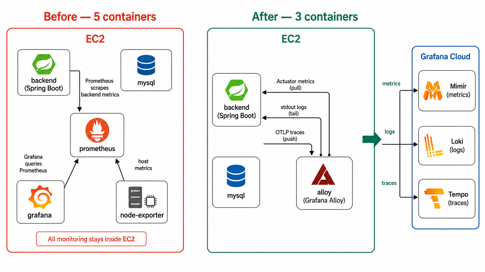
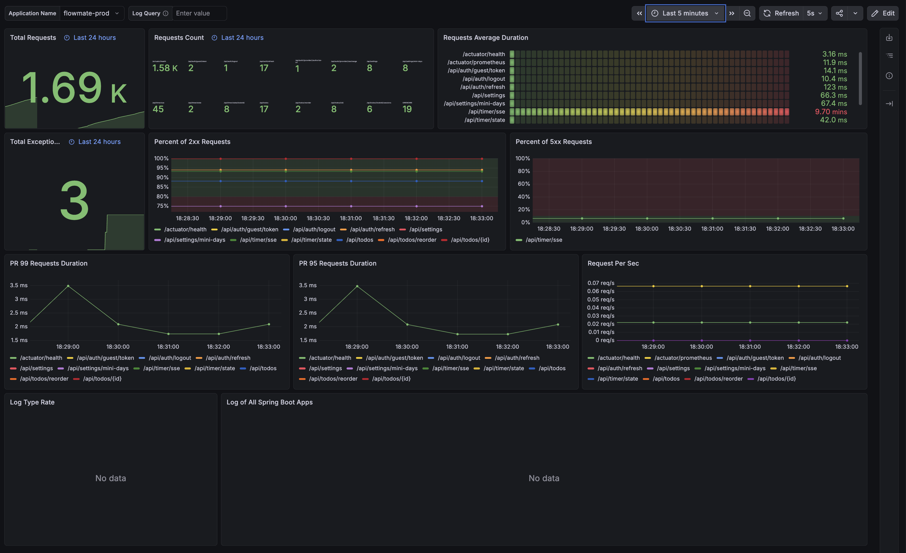
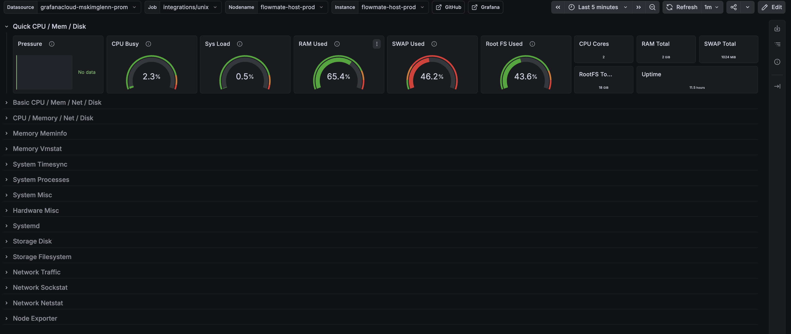
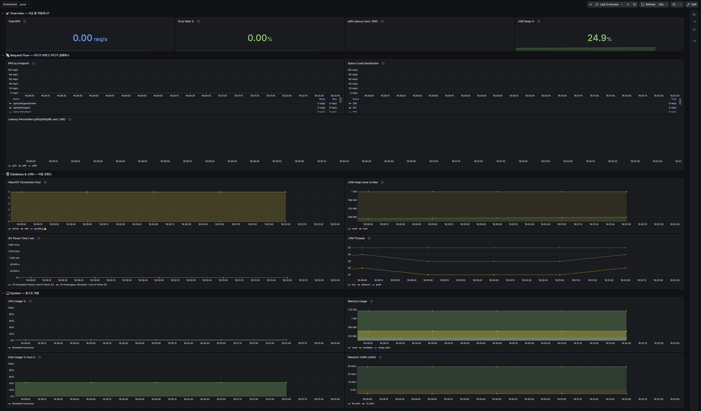

# Self-hosted 모니터링을 Alloy + Grafana Cloud로 전환하기

## 요약

- 문제: Self-hosted Prometheus + Grafana + node-exporter 구조에서 로그·트레이스를 붙일수록 컨테이너와 설정 파일이 증가
- 해결: EC2에는 Alloy 수집기 1개만 두고, 메트릭·로그·트레이스를 Grafana Cloud(Mimir·Loki·Tempo)로 전송
- 결과: 모니터링 컨테이너 3→1개, 이후 확장은 `config.alloy` 변경으로 처리



## 1. 문제 배경 — 직접 운영의 확장 비용

FlowMate는 EC2 + Docker Compose로 운영된다. 초기 모니터링도 같은 EC2 안에서 시작했다.

Prometheus + Grafana 조합은 표준적이고 무료이며 Docker 이미지로 바로 띄울 수 있다. 메트릭만 볼 때는 충분히 합리적인 선택이었다.

하지만 다음 단계가 문제였다.

| 문제      | 내용                                                                  | 영향               |
|---------|---------------------------------------------------------------------|------------------|
| 설정 중복   | dev/prod에 거의 같은 Prometheus, Grafana provisioning, dashboard 설정이 반복됨 | 한쪽만 수정하는 실수 발생   |
| 컨테이너 증가 | 로그에는 Loki/Promtail, 트레이스에는 Tempo가 추가됨                               | 단일 EC2 메모리 부담 증가 |
| 보안 표면   | self-hosted Grafana를 외부에서 보려면 nginx 프록시와 접근 제어가 필요함                 | 운영 설정 복잡도 증가     |

## 2. 기술 선택 — Grafana Cloud + Alloy

검토한 방향은 두 가지였다.

| 대안                    | 장점                               | 단점                       | 판단 |
|-----------------------|----------------------------------|--------------------------|----|
| Self-hosted 유지        | 외부 의존 적음, EC2 비용 외 추가 비용 없음      | 컨테이너와 설정 파일이 계속 증가       | 보류 |
| Grafana Cloud + Alloy | EC2에는 수집기 1개만 유지, UI는 Cloud에서 사용 | 무료 플랜 한도와 Alloy 설정 학습 필요 | 채택 |

Grafana Cloud를 쓰면 역할이 분리된다. EC2는 Alloy가 데이터를 수집하고, Grafana Cloud가 저장·시각화를 담당한다. Nginx에서 Grafana UI를 직접 노출하지 않는다.

이 구조가 현재 규모에 더 맞았다. 기능을 더 붙이기 전에 운영 복잡도를 줄이는 쪽이 더 싸다고 판단했다.

## 3. 전환 내용

### 제거한 것

```text
설정 파일:
  infra/dev/config/prometheus/
  infra/dev/config/grafana/
  infra/prod/config/prometheus/
  infra/prod/config/grafana/

컨테이너:
  docker-compose 서비스: prometheus, grafana, node-exporter
  docker volume: prometheus-data, grafana-data

Nginx:
  /grafana/ 프록시 블록
```

### 추가한 것

```text
infra/dev/config/alloy/config.alloy
infra/prod/config/alloy/config.alloy
```

`config.alloy` 하나가 네 가지 일을 한다.

```hcl
prometheus.scrape        // Spring Boot Actuator 메트릭
prometheus.exporter.unix // 호스트 시스템 메트릭
loki.source.docker       // Docker 컨테이너 로그
otelcol.receiver.otlp    // OTel trace 수신
```

전송 방식은 신호마다 다르다.

| 신호      | Alloy 컴포넌트                | Grafana Cloud 목적지 |
|---------|---------------------------|-------------------|
| Metrics | `prometheus.remote_write` | Mimir             |
| Logs    | `loki.write`              | Loki              |
| Traces  | `otelcol.exporter.otlp`   | Tempo             |

## 4. 현재 데이터 흐름

Spring Boot 요청 하나에서 세 신호는 아래처럼 흐른다.

```text
API 요청
  ↓ HTTPS
Browser → Host Nginx → Docker bridge
  ↓
Spring Boot (Java 21)
  │
  ├─ Actuator + Micrometer가 HTTP/JVM/DB 메트릭 누적
  │     ↑ Alloy가 15초마다 /actuator/prometheus pull
  │
  ├─ SLF4J → Logback JSON encoder → stdout
  │     ↓ Docker logging driver(json-file)
  │     ↓ Alloy가 docker socket으로 tail
  │
  └─ OTel Java agent가 HTTP/JDBC/JPA span 자동 생성
        ↓ OTLP HTTP batch
        → alloy:4318/v1/traces

Alloy
  ├─ Metrics → Mimir
  ├─ Logs    → Loki
  └─ Traces  → Tempo
```

| 신호      | 방식   | 누가 능동적인가                         | 이유                            |
|---------|------|----------------------------------|-------------------------------|
| Metrics | Pull | Alloy → backend                  | 시계열은 일정 주기 샘플링이 필요하다.         |
| Logs    | 간접   | backend는 stdout만 출력, Alloy가 tail | 앱은 로그 저장 위치를 몰라도 된다.          |
| Traces  | Push | OTel agent → Alloy               | 요청 이벤트가 발생한 시점에 보내는 것이 자연스럽다. |

Backend는 운영 지표를 노출하고, 로그를 stdout으로 쓰고, trace를 Alloy에 보낸다. Alloy는 세 신호를 Grafana Cloud로 전달한다.

## 5. 대시보드 구성

Grafana Cloud에는 세 종류의 대시보드를 둔다.

| 대시보드                      | 출처               | 용도                                         | Git 관리 |
|---------------------------|------------------|--------------------------------------------|--------|
| Spring Boot Observability | Community import | HTTP 요청, JVM heap, GC, thread, HikariCP 확인 | 아니오    |
| Node Exporter Full        | Community import | CPU, memory, disk, network 같은 host 지표 확인   | 아니오    |
| FlowMate Backend Overview | 직접 작성            | 매일 보는 1차 RED + Saturation 대시보드             | 예      |

기존 community dashboard는 이미 표준화된 패널이 많아 그대로 import했다. 대신 FlowMate에서 자주 보는 질문은 별도 대시보드로 묶었다.

- 지금 요청이 들어오고 있는가?
- 실패율이 튀는가?
- p99 latency가 임계치를 넘는가?
- JVM heap, GC, thread가 버티는가?
- HikariCP pool이 대기열을 만들고 있는가?
- EC2 host CPU, memory, disk, network가 포화되는가?

이 질문에 맞춰 `infra/grafana/dashboards/flowmate-overview.json`을 git으로 관리한다.

### 1. Spring Boot Observability



### 2. Node Exporter Full



### 3. FlowMate Backend Overview



## 6. 부하테스트에서의 활용

구축한 Observability가 실제 문제를 좁히는 데 어떻게 쓰였는지, 두 사례를 정리한다.

### v1 baseline (2026-03, 12 VU)

| 단계    | 내용                                  |
|-------|-------------------------------------|
| 관측    | 전역 실패율 0.06% — 통과처럼 보임              |
| 지표 확인 | timer PUT 한 경로에 실패 69건 집중, 5xx 스파이크 |
| 지표 확인 | HikariCP·JVM·host 포화 신호 없음          |
| 원인    | 서버 전체 문제가 아닌 MySQL deadlock         |

원인 분석과 해결은 [타이머 상태 저장의 동시성 제어](timer-deadlock.md)에서 다룬다.

### v3/v4 breakpoint (2026-05)

| 단계      | 내용                                           |
|---------|----------------------------------------------|
| 관측      | HikariCP pending 증가 — pool 부족으로 의심           |
| 지표 확인   | JVM heap·GC 여유, slow query 0건, host CPU 100% |
| 검증 (v4) | pool 10→20으로 변경 후 재측정 → throughput 25%↓      |
| 원인      | pool이 아니라 host 스펙 자체가 한계                     |

pool·thread 튜닝은 제외하고, 인스턴스 스펙업이나 DB hit 감소(Redis, MySQL 분리) 방향으로 방향성을 잡았다.

## 7. 회고

### 복잡도는 더 올라가기 전에 줄일 수 있을 때 줄이는 편이 좋다

Self-hosted Prometheus + Grafana는 잘 동작했다. 문제는 그 다음이였다.

로그와 트레이스를 붙인 뒤에 정리했다면 컨테이너와 설정 파일이 더 늘어난 상태에서 마이그레이션해야 했다.

이번 전환의 핵심은 비용 절감보다 운영 단순화였다. EC2는 앱 실행과 데이터 수집만 담당하고, 저장·조회·대시보드는 Grafana Cloud에 맡기는 쪽이 현재 규모에 더 적합하다고 판단했다.

### Observability에 대한 공부가 더 필요하다

Observability에 관한 기반은 만들었지만, 대시보드를 구성하고 부하테스트를 하면서 제대로 이해하지 못한 지표가 많다는 것을 여실히 느꼈다. HikariCP pending, JVM heap, GC pause,
host CPU, slow query log 같은 지표를 함께 놓고 해석해야 했고, 어떤 지표가 원인이고 어떤 지표가 결과인지 구분하는 과정이 필요했다.

결국 Observability를 제대로 활용하려면 도구보다 먼저 지표에 대한 이해가 필요하다는 생각이 들었다. 각 지표가 무엇을 의미하는지, 정상 범위와 이상 신호는 어떻게 구분하는지, 하나의 지표 변화가 다른
지표들과 어떤 연관관계를 가지는지 알아야 문제를 더 정확히 좁히며 파악할 수 있을 거라는 생각이 들었다.

앞으로는 JVM, DB connection pool, host resource, HTTP latency 같은 지표들의 개념과 관계를 더 공부하면서 해석하는 힘을 키워야겠다.
