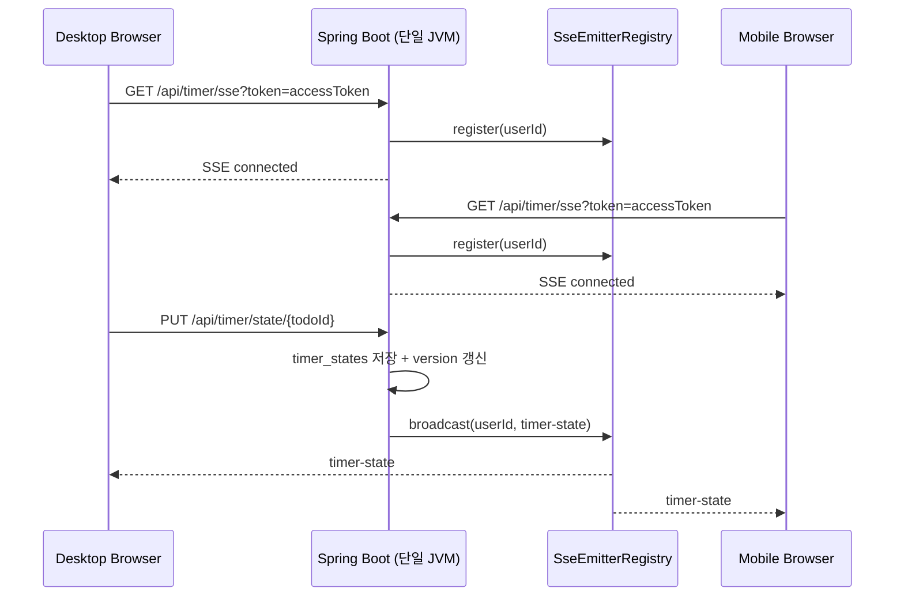
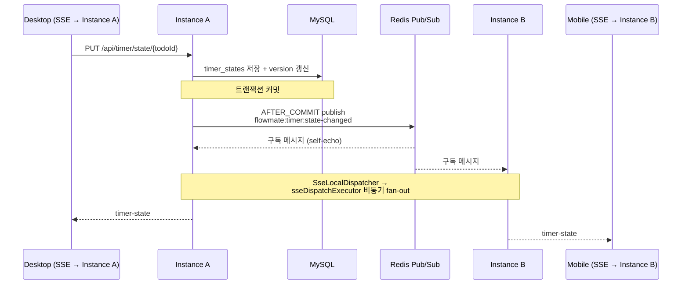
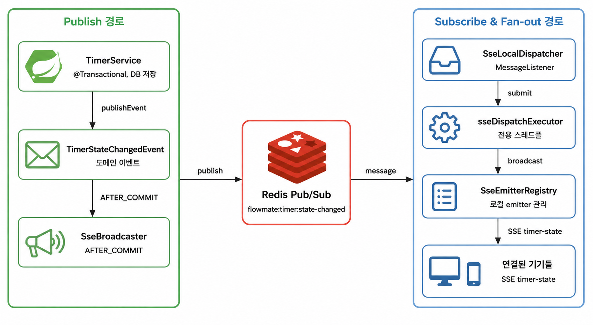

# Redis Pub/Sub으로 SSE 수평 확장하기

> 선행 문서: [SSE로 멀티디바이스 타이머 동기화하기](sse-sync.md)

## 요약

- 문제: SSE broadcast가 단일 JVM 메모리 기반이라, 인스턴스 2대 이상에서 cross-instance 이벤트 전파 불가
- 해결: 정본은 MySQL이므로 메시지 영속성은 불필요. Redis Pub/Sub at-most-once 전달로 인스턴스 간 전파
- 결과: 통합 테스트 → 로컬 2-JVM(도달률 0→100%) → 부하 30,000건 유실 0% → EC2 채널 실측, 4단계 검증

## 1. 문제 배경 — 단일 JVM broadcast의 한계

Redis 도입 전 `SseEmitterRegistry`는 `userId`별 emitter를 JVM 메모리(`ConcurrentHashMap`)에 보관하고, 상태 변경 시 동일 `userId`의 모든 emitter에
broadcast한다. 이 구조는 단일 인스턴스에서는 문제가 없지만, 수평 확장 시 인스턴스 간 emitter 정보가 공유되지 않아 broadcast 범위가 해당 JVM으로 제한된다.

예를 들어 인스턴스를 2대로 확장하면 다음과 같은 상황이 발생한다.

```text
PUT /api/timer/state ──► Instance A
                          │ SseEmitterRegistry.broadcast(userId)
                          ▼
              Instance A에 연결된 기기만 수신 ✅
              Instance B에 연결된 기기는 수신 불가 ❌
```

Instance A의 `SseEmitterRegistry`는 Instance B의 메모리에 등록된 emitter를 알 수 없다. 따라서 같은 사용자가 PC는 Instance A에, 모바일은 Instance B에
연결한 상태라면 한쪽에서 타이머 상태를 변경해도 다른 쪽 기기에는 이벤트가 전달되지 않는다.

즉, 인스턴스를 확장하는 순간 반드시 재현되는 구조적 한계이다.

## 2. 기술 선택 — 왜 Redis Pub/Sub인가

인스턴스 간 이벤트 전파에는 여러 선택지가 있다. 이때 핵심 판단 기준은 두 가지였다.

첫째, 메시지 영속성이 필요한가.  
둘째, 추가되는 운영 부담이 현재 문제의 규모에 적절한가.

다음과 같은 선택지를 고려했다.

| 방식                | 장점                                     | 단점                                         | 판단     |
|-------------------|----------------------------------------|--------------------------------------------|--------|
| Sticky Session    | 별도 메시지 브로커 없이 특정 클라이언트를 같은 인스턴스로 고정 가능 | 다중 기기·장애·재배포 상황에서 이벤트 전파 문제를 근본적으로 해결하지 못함 | 임시 완화  |
| Kafka             | 메시지 보장, 파티션 내 순서 보장, replay 지원         | 현재 요구사항 대비 운영·구성 복잡도가 높음                   | 과잉     |
| Redis Streams     | 소비자 그룹, ack, replay 지원                 | 단순 이벤트 전파 목적 대비 구현 복잡도가 높음                 | 과잉     |
| DB Polling        | 추가 인프라 불필요                             | 실시간성이 떨어지고 DB 부하가 증가할 수 있음                 | 부적합    |
| **Redis Pub/Sub** | 낮은 지연, 구현 단순, Spring Data Redis 연동 용이  | at-most-once 전달로 메시지 유실 가능                 | **채택** |

### Redis Pub/Sub을 선택한 이유

첫 번째 판단 기준은 메시지 영속성이 필요한지였다. 타이머 상태의 단일 정본은 MySQL의 `timer_states`이며, Redis Pub/Sub은 이 정본을 대체하지 않는 휘발성 상태 전파 계층이다. 이벤트가
`state`를 포함하더라도 영속 상태는 MySQL에 남으므로, Pub/Sub 메시지 유실이 곧바로 데이터 손실로 이어지지는 않는다.

두 번째 판단 기준은 운영 부담이 현재 문제의 규모에 적절한지였다. Redis Streams나 Kafka는 메시지 영속성, replay, ack 기반 처리를 제공하지만, 현재 요구사항은 인스턴스 간 이벤트 전파에
한정된다. 이 목적에 비해 Streams/Kafka는 운영 및 구현 복잡도가 크다.

결론적으로 FlowMate에는 메시지 영속성보다 단순한 이벤트 전파가 더 중요했으며, 낮은 지연, 단순한 구조, Spring Data Redis 연동성을 갖춘 Redis Pub/Sub이 가장 적합했다.

## 3. 아키텍처

### Before — 단일 인스턴스

`SSE 연결 인증`, `register`, `PUT`, `broadcast`가 모두 하나의 JVM 안에서 처리된다.



단일 인스턴스에서는 `SseEmitterRegistry`가 해당 사용자의 모든 emitter를 같은 JVM 메모리에서 관리하므로 broadcast가 정상적으로 완료된다. 그러나 인스턴스가 2대 이상으로 확장되면 각
JVM의 emitter registry가 분리되기 때문에, 다른 인스턴스에 등록된 emitter에는 이벤트가 도달하지 못한다.

### After — Redis Pub/Sub 다중 인스턴스

`PUT`을 받은 인스턴스는 트랜잭션 커밋 후 Redis 채널에 publish하고, 해당 채널을 구독 중인 모든 인스턴스는 자기 JVM에 연결된 emitter에 fan-out한다.



발신 인스턴스도 Redis 채널을 구독하므로 자신이 publish한 메시지를 다시 받는다. 이 self-echo는 의도된 동작으로, 모든 인스턴스가 동일하게 “구독 메시지 수신 → 로컬 emitter fan-out”
흐름만 처리하게 해준다.

발신 기기가 같은 이벤트를 다시 받더라도 클라이언트가 `version`으로 최신 여부를 판단하므로 상태 정합성에는 영향을 주지 않는다.

### 핵심 설계 결정

| 결정                        | 이유                                                                       |
|---------------------------|--------------------------------------------------------------------------|
| **도메인 이벤트로 분리**           | 서비스 코드가 인프라에 직접 의존하지 않아 향후 전파 방식 변경이 쉽다                                 |
| **AFTER_COMMIT에 publish** | 커밋 전에 publish하면 롤백될 상태가 전파되는 유령 이벤트가 발생할 수 있다                           |
| **fan-out은 executor에 위임** | 느린 클라이언트가 Redis 구독 처리를 지연시키지 않도록 비동기로 격리한다                              |
| **전파 실패는 요청 처리와 분리**      | 정본은 DB에 있으므로, 전파 실패가 사용자 PUT이나 다른 기기 전송까지 연쇄적으로 막지 않도록 한다              |

## 4. 구현 컴포넌트

| 클래스                      | 역할                                                                            |
|--------------------------|-------------------------------------------------------------------------------|
| `TimerStateChangedEvent` | 타이머 상태 변경 정보를 담는 도메인 이벤트. `userId`, `todoId`, `version`, `ts`, `state`를 포함한다. |
| `TimerService`           | 타이머 상태를 DB에 저장하고, 직접 broadcast하지 않고 도메인 이벤트만 발행한다.                            |
| `SseBroadcaster`         | 트랜잭션 커밋 후 Redis 채널(`flowmate:timer:state-changed`)에 이벤트를 publish한다.           |
| `SseLocalDispatcher`     | Redis 메시지를 수신한 뒤 `sseDispatchExecutor`에 fan-out 작업을 위임한다.                     |
| `SseEmitterRegistry`     | 기존처럼 `userId`별 emitter를 관리하고, 로컬 JVM에 연결된 기기들에게만 broadcast한다.                 |
| `sseDispatchExecutor`    | Redis 구독 스레드와 SSE 전송을 격리하는 전용 스레드풀. `RedisConfig`에서 `@Bean`으로 정의한다.           |
| `RedisConfig`            | Redis 연결, 메시지 리스너, serializer, executor를 설정한다.                                |

컴포넌트 흐름은 다음과 같다. Redis 채널을 기준으로 왼쪽은 **publish 경로**, 오른쪽은 **subscribe & fan-out 경로**다.



리팩토링의 핵심은 `TimerService`에서 직접 broadcast 호출을 제거한 것으로, `TimerService`는 DB 저장과 도메인 이벤트 발행까지만 담당하고, Redis publish와 SSE
fan-out은 각각 `SseBroadcaster`, `SseLocalDispatcher`가 담당한다.

덕분에 기존 `upsertState`의 동시성 제어와 `version` 증가 로직은 그대로 유지하면서, 이벤트 전파 계층만 Redis Pub/Sub 기반으로 교체할 수 있었다.

## 5. 검증

### 5.1 cross-instance 도달 테스트

첫 번째 검증은 하나의 Spring Context에서 Redis publish가 subscriber를 거쳐 로컬 `SseEmitterRegistry.broadcast()`까지 도달하는지 확인하는 통합 테스트다.

> Redis에 publish한 이벤트가 subscriber와 로컬 fan-out 경로까지 도달하는가?

이를 `MultiInstanceSseIntegrationTest`로 먼저 정의했다.

```java

@Test
void 인스턴스A_publish가_인스턴스B_emitter_registry에_도달() {
    TimerStateChangedEvent event = TimerStateChangedEvent.of(
            "user-1", "todo-1", 100L, "{\"status\":\"running\"}"
    );

    timerStateChangedEventRedisTemplate.convertAndSend(SseBroadcaster.CHANNEL, event);

    await().atMost(2, TimeUnit.SECONDS).untilAsserted(() ->
            verify(instanceBRegistry).broadcast(eq("user-1"), any())
    );
}
```

이 테스트는 TDD로 진행했다. 실제 프로세스 간 전달은 다음 절의 로컬 2-JVM 측정으로 별도 검증했다.

먼저 `SseLocalDispatcher` 구현 전에는 Redis 메시지를 받아 로컬 emitter로 fan-out할 구독자가 없으므로 `broadcast()`가 호출되지 않아 `RED`를 확인했다.

이후 `SseLocalDispatcher`를 구현해 Redis 채널을 구독하고, 수신 메시지를 `SseEmitterRegistry.broadcast()`로 전달하자 `GREEN`을 확인했다.

### 5.2 로컬 2-JVM Before / After 측정

단순한 테스트 외에도 실제로 로컬 환경에서 JVM을 2개 띄워 동일 문제를 재현했다.

`8080`, `8081` 두 프로세스를 같은 로컬 MySQL에 연결하고, 동일 사용자 기준으로 8080에만 `PUT` 요청 5회를 보낸 뒤 8081에 연결된 SSE 클라이언트의 수신 건수를 확인했다.

| 측정 항목                          | Before (`main`) | After (`feat/redis-sse-tdd`) |
|--------------------------------|----------------:|-----------------------------:|
| Device A (8080) timer-state 수신 |               5 |                            5 |
| Device B (8081) timer-state 수신 |           **0** |                        **5** |
| **cross-instance 도달률**         |          **0%** |                     **100%** |
| Redis publish 메시지 수            |               0 |                            5 |

Before에서는 이벤트가 8080 JVM 메모리 안에서만 broadcast되어 8081의 클라이언트는 아무 이벤트도 받지 못했다.

After에서는 Redis Pub/Sub을 통해 두 인스턴스 모두 메시지를 수신했고, 8081에 연결된 클라이언트도 5건 모두 정상 수신했다.

### 5.3 부하 환경에서 fan-out 정량 측정

로컬 2-JVM 환경에 부하를 걸어 도달률·유실·지연을 정량으로 측정했다. SSE 클라이언트는 인스턴스 B(`:8081`)에만 연결하고 PUT은 인스턴스 A(`:8080`)에만 보내 순수 cross-instance
경로만 측정하도록 고정했다.

| 단계 | 동시 연결 | PUT/s | 이벤트 수  | 도달률      | 유실     | p50  | p95   | p99   |
|----|-------|-------|--------|----------|--------|------|-------|-------|
| 1  | 10    | 20    | 600    | **100%** | **0%** | 15ms | 20ms  | 93ms  |
| 2  | 50    | 100   | 3,000  | **100%** | **0%** | 6ms  | 8ms   | 11ms  |
| 3  | 100   | 400   | 12,000 | **100%** | **0%** | 6ms  | 10ms  | 22ms  |
| 4  | 200   | 1,000 | 30,000 | **100%** | **0%** | 11ms | 108ms | 244ms |

모든 단계에서 도달률 100%, 유실 0%였다. 부하의 비용은 유실이 아니라 지연 꼬리의 증가로 나타났다(p95 8ms → 108ms).

### 5.4 EC2 Redis 채널 실측

로컬 검증 이후 dev와 prod EC2 환경에도 Redis를 배포해 실제 채널 메시지 흐름을 확인했다.

`/actuator/health`에서 Redis 상태가 `UP`임을 확인했고, Redis 채널을 직접 구독한 상태로 브라우저에서 타이머를 조작했다.

```text
$ docker exec flowmate-redis redis-cli -a *** SUBSCRIBE flowmate:timer:state-changed

# 타이머 시작
{"userId":"8fbb...","todoId":"b705...","version":1782170915939,
 "ts":1782170915939,"state":"{...\"status\":\"running\"...}"}

# 일시정지
{"userId":"8fbb...","todoId":"b705...","version":1782170925205,
 "ts":1782170925205,"state":"{...\"status\":\"paused\"...}"}
```

EC2 Redis 채널에서 메시지가 확인되었고, 멀티 탭 동기화로 구독 이후 fan-out과 브라우저 수신까지 검증했다.

## 6. 트레이드오프 요약

이번 구조의 핵심 트레이드오프는 메시지 보장보다 단순한 이벤트 전파를 우선한 것이다.

| 결정                       | 얻은 것                                             | 감수한 비용                            | 판단                                  |
|--------------------------|--------------------------------------------------|-----------------------------------|-------------------------------------|
| **Redis Pub/Sub 채택**     | 단순한 구조로 cross-instance 이벤트 전파 가능                 | at-most-once 특성상 메시지 유실 가능        | 최종 상태는 MySQL에 있으므로 유실이 곧 데이터 손실은 아님 |
| **AFTER_COMMIT publish** | DB에 확정된 상태만 전파                                   | 커밋 전 상태는 즉시 전파되지 않음               | 유령 broadcast 방지를 위해 정합성을 우선         |
| **비동기 fan-out**          | 느린 SSE 클라이언트가 Redis 구독 처리를 막지 않음                 | executor 큐 포화 시 일부 전송 지연 또는 유실 가능 | 실시간 알림보다 전체 전파 흐름의 격리가 중요           |
| **전파 실패와 요청 처리 분리**      | Redis 장애나 개별 emitter 실패가 사용자 `PUT`과 DB 저장을 막지 않음 | Redis 장애 중에는 실시간 동기화가 중단될 수 있음    | 데이터는 DB에 남기고, 실시간성 실패만 감수           |

## 7. 회고

### 단일 JVM broadcast 문제를 Redis Pub/Sub으로 해소했다

기존 SSE 구조는 같은 JVM 안에서는 문제없이 동작했지만, 인스턴스가 2대 이상으로 늘어나면 각 인스턴스의 SseEmitterRegistry가 서로 분리되는 한계가 있었다. 같은 사용자의 기기가 서로 다른
인스턴스에 연결되면, 한쪽에서 발생한 타이머 이벤트가 다른 인스턴스의 기기까지 도달하지 못했다.

이번 작업에서는 이 문제를 Redis Pub/Sub으로 해결했다. 각 인스턴스는 자기 JVM에 연결된 emitter만 관리하고, 인스턴스 간 이벤트 전파는 Redis 채널을 통해 처리하도록 역할을 분리했다. 그 결과
로컬 2-JVM 환경에서 cross-instance 도달률을 0%에서 100%로 개선할 수 있었다.

### 메시지 보장보다 단순한 이벤트 전파를 선택했다

이번 도메인에서 Redis Pub/Sub은 MySQL 정본을 대체하지 않는 휘발성 상태 전파 계층이다. 이벤트가 `state`를 포함하더라도 영속 상태는 `timer_states`가 관리하므로, Pub/Sub
메시지가
유실되더라도 곧바로 데이터 손실로 이어지지는 않는다.

이 전제를 기준으로 Kafka나 Redis Streams처럼 메시지 영속성과 replay를 제공하는 구조는 현재 문제에 비해 과하다고 판단했다. 대신 Redis Pub/Sub을 사용해 운영 부담을 낮추고, 인스턴스
간 이벤트 브릿지라는 목적에 집중했다.
