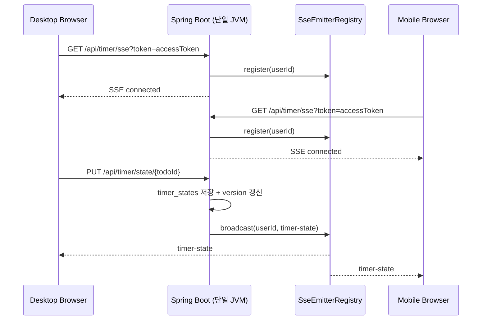

# SSE로 멀티디바이스 타이머 동기화하기

> 후속 문서: [Redis Pub/Sub으로 SSE 수평 확장하기](redis-sse-pubsub.md)

## 요약

- 문제: 타이머 상태가 Zustand + localStorage 기반이라, 같은 계정이어도 기기 간 상태 공유 불가
- 해결: 서버 -> 클라이언트 단방향 push만 필요하므로 SSE + REST 조합으로 인프라 추가 없이 구현
- 결과: 타이머 조작이 모든 기기에 즉시 반영, version 단조 증가로 이벤트 역전 방지. k6 163,205건 에러율 0%, p95 45.58ms

## 1. 문제 배경: 기기 간 상태 공유 부재

FlowMate의 타이머는 초기에 Zustand 스토어 + localStorage로만 관리됐다.

한 기기 안에서는 새로고침해도 타이머가 유지됐지만, 기기 간에는 상태가 전혀 공유되지 않았다.

```text
Desktop: 25분 뽀모도로 시작 (running)
                ↓ 사용자가 모바일로 전환
Mobile:  타이머 없음 (idle) ❌
```

요구사항은 두 가지였다. 한 기기에서 타이머를 변경하면 다른 기기에 즉시 반영될 것, 이벤트 순서가 역전되어도 최신 상태를 유지할 것.

게스트는 동기화 대상에서 제외한다. 게스트 토큰은 기기별로 독립된 정체성을 가지므로, 두 기기가 같은 게스트 계정을 공유할 경로가 없다.

## 2. 기술 선택: WebSocket vs Polling vs SSE

핵심 판단 기준은 데이터 흐름의 비대칭이었다. 클라이언트 -> 서버는 start/pause/resume/stop 시점에만 발생하므로 REST PUT으로 충분하지만, 서버 -> 클라이언트는 다른 기기의 변경을 즉시 알려야
하므로 push가 필요하다.

| 방식                | 장점                              | 단점                              | 판단     |
|-------------------|---------------------------------|---------------------------------|--------|
| WebSocket (STOMP) | 완전한 양방향 실시간 채널                  | 메시지 브로커 인프라, 세션과 구독 관리 복잡도      | 과잉     |
| Polling           | 구현 단순, 인프라 변경 없음                | 실시간성 부족, 빈 응답 트래픽 낭비            | 부적합    |
| **SSE + REST**    | HTTP 표준, Spring `SseEmitter` 내장 | 클라이언트 -> 서버 단방향 불가 (REST 병행 필요) | **채택** |

### SSE + REST를 선택한 이유

WebSocket(STOMP)은 양방향 채널이 강력하지만, 타이머 동기화에는 단방향 push면 충분하다. 브로커 인프라까지 따라오는 복잡도는 현재 요구사항에 비해 과잉이었다. Polling은 인프라가 가장
단순하지만, 페이즈 전환 순간 다른 기기에서 몇 초간 이전 상태가 보이는 경험은 부적합했다.

SSE는 서버 -> 클라이언트 단방향 push에 정확히 맞는다. HTTP 표준이라 Nginx 설정만으로 동작하고, Spring이 `SseEmitter`를 내장 지원해 추가 라이브러리 없이 구현할 수 있다.

## 3. 아키텍처

이 문서는 Redis 도입 전 단일 인스턴스 구현을 다룬다. SSE 연결 인증, register, PUT, broadcast가 모두 하나의 JVM 안에서 처리된다.



단일 인스턴스에서는 `SseEmitterRegistry`가 모든 emitter를 같은 JVM 메모리에서 관리하므로 broadcast가 모든 기기에 도달한다.

## 4. 구현

타이머 상태는 MySQL을 단일 정본으로 관리한다. 앱 초기화 시 `GET /api/timer/state`로 현재 상태를 가져온다.

### 4.1 스키마

```text
CREATE TABLE timer_states
(
    todo_id    VARCHAR(36)  NOT NULL PRIMARY KEY,
    user_id    VARCHAR(36)  NOT NULL,
    state_json TEXT         NULL,
    version    BIGINT       NOT NULL DEFAULT 0,
    updated_at TIMESTAMP(3) NOT NULL DEFAULT CURRENT_TIMESTAMP(3),
    created_at TIMESTAMP(3) NOT NULL DEFAULT CURRENT_TIMESTAMP(3),

    CONSTRAINT fk_timer_states_todo
        FOREIGN KEY (todo_id) REFERENCES todos (id) ON DELETE CASCADE
);
CREATE INDEX idx_timer_states_user ON timer_states (user_id, updated_at DESC);
```

| 컬럼                      | 설계 결정                                        |
|-------------------------|----------------------------------------------|
| `todo_id` PK            | Todo와 1:1 관계, 별도 합성 ID 불필요                   |
| `user_id`               | broadcast 대상 조회 + 인덱스 키                      |
| `state_json`            | `NULL`이면 idle, JSON이면 활성 상태                  |
| `version`               | 이벤트 최신성 판단 기준값, 변경 시마다 단조 증가                 |
| `idx_timer_states_user` | `user_id, updated_at DESC`. 사용자별 최근 상태 조회 커버 |

### 4.2 `version` 단조 증가 방식

상태마다 단조 증가하는 정수 `version`을 부여하고, 클라이언트는 마지막으로 적용한 version보다 작은 이벤트를 무시한다.

```text
long newVersion = Math.max(System.currentTimeMillis(), lastVersion + 1);
```

`max(now, lastVersion + 1)`은 두 가지 위험을 동시에 방지한다.

- `System.currentTimeMillis()`만 쓰면: NTP 보정 등으로 시계가 뒤로 가면 단조성이 깨진다
- `lastVersion + 1`만 쓰면: 시간 기반 추적이 불가능해져 디버깅 시 순서 파악이 어렵다

클라이언트는 `todoId`별로 마지막으로 적용한 version을 Map에 보관한다.

```
v=100: A pause
v=101: B resume
A의 클라이언트가 늦게 도착한 자신의 pause(v=100)를 수신
→ seenVersion[todoId] = 101 > 100 이므로 무시
```

### 4.3 Soft Delete: state_json = NULL

타이머를 정지하면 행을 삭제하지 않고 `state_json`을 `NULL`로 설정한다.

```
v=100: running   state_json = "{...}"
v=101: idle      state_json = NULL    (행 유지)
v=102: running   state_json = "{...}"
```

이유는 **version 연속성**이다. 만약 idle 시점에 행을 삭제하면 v=102에서 새 행이 생기고, 다른 기기는 v=101(삭제됨)과 v=102(새로 생긴) 사이의 관계를 판단할 수 없다. `NULL`로
유지하면 같은 row의 version이 단조 증가하므로 모든 기기가 정확히 최신 상태를 판별할 수 있다.

### 4.4 SseEmitterRegistry: 연결 관리와 broadcast

SseEmitterRegistry는 같은 `userId`의 여러 SSE 연결을 추적하고 broadcast를 담당한다.

```java
private final ConcurrentHashMap<String, CopyOnWriteArrayList<ConnectionEntry>> connections;

private record ConnectionEntry(String internalId, SseEmitter emitter, ScheduledFuture<?> heartbeatTask) {
}
```

멀티 연결 등록과 제거가 동시에 발생하므로 `ConcurrentHashMap` + `CopyOnWriteArrayList`로 thread-safe하게 관리한다.

- `userId` 키 아래에 여러 `ConnectionEntry`를 보관 (PC + 모바일 + 다중 탭)
- 각 연결의 `internalId`로 제거 시점 식별

#### 등록과 1시간 timeout

```text
SseEmitter emitter = new SseEmitter(SSE_TIMEOUT_MS); // 1시간

emitter.onCompletion(() -> removeEntry(userId, internalId));
emitter.onTimeout(() -> removeEntry(userId, internalId));
emitter.onError(e -> removeEntry(userId, internalId));

emitter.send(SseEmitter.event().name("connected").data("ok"));
```

연결 직후 `connected` 이벤트를 1회 전송해 클라이언트가 SSE 진입 성공을 즉시 확인할 수 있게 한다. 정상 완료, timeout, 오류 중 어떤 이유로 끊기든 정리 로직은 동일하므로 세 콜백 모두
`removeEntry`를 호출한다.

#### 25초 heartbeat

각 연결에 `scheduleAtFixedRate`로 25초 간격 heartbeat를 등록한다.

인프라 타임아웃(Nginx `proxy_read_timeout 3600s`, Spring `SseEmitter` 1시간)이 길어도 25초 heartbeat가 필요한 이유는 세 가지다.

- **중간망 idle timeout 대응**: 모바일 NAT, 기업 프록시, ISP 방화벽 등이 idle 연결을 30초~수 분 안에 끊을 수 있다.
- **죽은 연결 감지**: 클라이언트 비정상 종료 시 heartbeat write 실패로 빠르게 정리한다.
- **빠른 재연결 유도**: 네트워크 장애 시 25초 이내에 브라우저 `EventSource.onerror`가 발동되어 재연결을 시도한다.

#### broadcast fire-and-forget

`broadcast`는 같은 `userId`의 모든 emitter에 이벤트를 순차 전송하되, 개별 전송 실패 시 해당 연결만 정리하고 예외는 삼킨다. 끊긴 연결의 전송 실패가 나머지 기기 전파를 중단시키지 않도록
격리하기 위해서다. 정본은 MySQL에 이미 저장된 상태이므로, 전파 실패가 데이터 손실로 이어지지는 않는다.

#### self-echo: 발신자 식별 없이 전체 broadcast

`broadcast`는 같은 `userId`의 모든 SSE 연결에 동일한 이벤트를 전송한다. 따라서 `PUT`을 일으킨 발신자 기기도 자기 이벤트를 다시 수신한다(self-echo).

발신자를 제외하는 방식도 가능하지만, 서버 로직을 단순하게 유지하기 위해 발신자가 자기 이벤트를 받더라도 `version` 비교로 중복 적용을 방지한다.

### 4.5 SSE 인증: 쿼리 파라미터 기반 토큰 전달

브라우저 표준 `EventSource` API는 커스텀 `Authorization` 헤더 설정을 지원하지 않는다.

```text
// 불가능
new EventSource('/api/timer/sse', {headers: {'Authorization': 'Bearer ...'}})

// 쿼리 파라미터로 토큰 전달
new EventSource(`/api/timer/sse?token=${encodeURIComponent(token)}`)
```

서버는 쿼리 파라미터로 받은 토큰을 `parseToken` 한 번으로 만료와 서명을 동시 검증하고, `role=member`가 아니면 401로 거절한다.

| 방식                       | 장점                                   | 단점                            | 판단     |
|--------------------------|--------------------------------------|-------------------------------|--------|
| 단기 SSE 티켓 발급             | access token 원문 노출 방지, 노출 시 영향 범위 축소 | 발급 API, 저장소, 만료 정책, 일회성 처리 필요 | 과잉     |
| **쿼리 파라미터 access token** | 별도 인프라 없이 기존 토큰 재사용                  | URL 노출 위험                     | **채택** |

쿼리 파라미터로 access token을 전달하면 액세스 로그, Referer, 브라우저 history 등에 토큰이 기록될 수 있지만, HTTPS로 전송 구간을 보호하고 Access Token TTL을 15분으로
짧게 유지해 노출 시 재사용 가능한 시간을 제한한다.

## 5. 검증

### 5.1 단위 테스트

구현의 핵심 설계 결정마다 단위 테스트를 작성해 정합성을 확인했다.

| 검증 대상              | 테스트                      | 확인 내용                                                         |
|--------------------|--------------------------|---------------------------------------------------------------|
| version 단조 증가      | `TimerServiceTest`       | 기존 row가 있을 때 `newVersion ≥ lastVersion + 1` 보장                |
| 동시 first insert 충돌 | `TimerServiceTest`       | `DataIntegrityViolationException` 발생 시 winner version 위에서 재계산 |
| soft delete        | `TimerServiceTest`       | idle 시 `stateJson = null` 설정, 활성 조회 시 idle row 제외             |
| broadcast 실패 격리    | `SseEmitterRegistryTest` | 전송 실패 시 예외를 호출자에게 전파하지 않음                                     |
| 다중 연결 broadcast    | `SseEmitterRegistryTest` | 같은 userId의 모든 emitter에 이벤트 전달                                 |
| SSE 인증: member 허용  | `TimerControllerTest`    | 유효한 member 토큰이면 `SseEmitterRegistry.register()` 호출            |
| SSE 인증: guest 차단   | `TimerControllerTest`    | `role ≠ member`이면 401                                         |
| SSE 인증: 무효 토큰      | `TimerControllerTest`    | 서명과 만료 검증 실패 시 401                                            |

### 5.2 k6 부하 테스트

dev 환경에 k6 baseline 부하를 걸어 163,205건 요청에서 에러율 0%를 확인했다.

| 측정 항목  | 결과        |
|--------|-----------|
| 총 요청 수 | 163,205   |
| 에러율    | **0.00%** |
| p95    | 45.58ms   |
| p99    | 150.14ms  |

## 6. 트레이드오프 요약

이번 구조의 핵심 트레이드오프는 인프라 단순성과 정본 단일화를 우선하여 결정했다.

| 결정                    | 얻은 것             | 감수한 비용         | 판단                 |
|-----------------------|------------------|----------------|--------------------|
| **SSE + REST**        | 단순 인프라, 내장 지원    | REST 병행 필요     | 단방향 push로 충분       |
| **MySQL 단일 정본**       | 정본 단일화           | 초기 로딩 시 서버 의존  | snapshot fetch로 보완 |
| **단조 증가 version**     | 역전을 정수 하나로 해결    | replay 없음      | LWW 구조에 충분         |
| **state_json = NULL** | version 연속성 유지   | idle row 잔존    | 연속성 우선             |
| **25초 heartbeat**     | 중간망 단절과 죽은 연결 감지 | 주기적 트래픽        | 타임아웃만으로 중간망 통제 불가  |
| **fire-and-forget**   | 실패 격리            | 일부 SSE 누락 가능   | 재접속 snapshot으로 복구  |
| **self-echo**         | 서버 로직 단순화        | 발신자도 자기 이벤트 수신 | version 비교로 처리     |
| **query param 토큰**    | 기존 토큰 재사용        | URL 노출 위험      | 짧은 TTL + HTTPS로 수용 |

## 7. 회고

### 단방향 push만으로 동기화 요구사항을 충족했다

타이머 동기화에 양방향 채널은 필요하지 않았다. 서버 -> 클라이언트 단방향 push만으로 요구사항을 충족했고, SSE + REST 조합으로 별도 인프라 없이 구현할 수 있었다. 이벤트 역전 문제는 단조 증가
`version`을 적용해 클라이언트가 자신이 마지막으로 적용한 version보다 작은 이벤트를 무시하는 것으로 해결했다.

### SSE는 코드 구현만으로 끝나지 않았다

SSE 연결은 Spring의 `SseEmitter`를 활용해 구현하는 것과, 그 연결이 실제 HTTPS 환경에서 유지되는 것은 별개의 문제였다. 브라우저 `EventSource`의 재연결 동작, Nginx의
proxy buffering과 timeout 설정, 중간망의 idle 연결 정리 같은 인프라와 네트워크 레벨의 이해가 함께 필요했다. 이 부분에 대한 선행 지식 없이 진행해 프로덕션에서 SSE 연결이 끊기는 문제를
겪었고, 이 경험은 [SSE 연결 유지 실패 해결: Workbox 충돌과 Nginx idle timeout](sse-timeout.md)에 정리했다.

### 단일 인스턴스의 구조적 한계

이 구조에서 `SseEmitterRegistry`는 JVM 메모리에 연결을 보관하므로, 인스턴스가 2대 이상으로 확장되면 다른 인스턴스에 연결된 기기에 이벤트가 도달하지 못하는 한계가 있다. 이 문제는 이후
Redis Pub/Sub을 도입해 해결했으며, 자세한 내용은 [Redis Pub/Sub으로 SSE 수평 확장하기](redis-sse-pubsub.md)에 정리했다.
