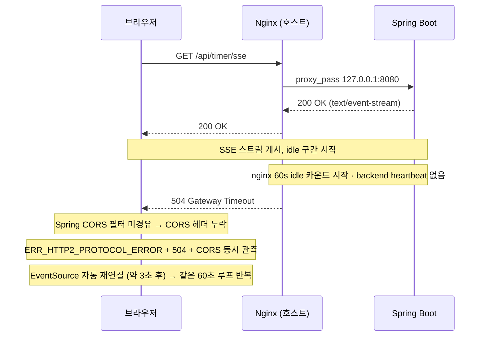

# SSE 연결 유지 실패 분석과 해결: Workbox 충돌과 Nginx 60초 idle timeout

## 요약

- 문제 배경: SSE 도입 직후 `/api/timer/sse` 연결이 두 단계로 실패 — 처음엔 `ERR_FAILED`로 오픈 자체가 막혔고, 그 다음엔 200 OK로 열려도 정확히 60초 후 504로 끊김
- 원인 1 (T1): PWA Workbox runtime caching이 `/api/*` 전체를 가로채 long-lived SSE 스트림 처리 실패
- 해결 1: Workbox runtimeCaching에서 `/api/timer/sse` 예외 처리
- 원인 2 (T2): Nginx idle timeout 60초 + Backend heartbeat 부재 + Spring async timeout 미명시
- 해결 2: Nginx `/api/timer/sse` 전용 location 분리 + 백엔드 25초 heartbeat + `request-timeout 1h` +
  `AsyncRequestTimeoutException` 503 매핑
- 검증: SSE 1시간 이상 안정 유지, nginx 504 / backend `AsyncRequestTimeoutException` 모두 0건

## 1. 문제 배경

FlowMate의 타이머는 멀티디바이스에서 같은 상태를 보여주기 위해 서버에 상태를 저장하고 SSE로 타이머 상태를 전파한다.

SSE를 처음 dev 환경에 올린 직후 두 단계로 에러가 발견됐다.

1. 유저 로그인 직후 SSE 연결이 곧장 실패 — 콘솔에 `ERR_FAILED`·`workbox no-response`·CORS
2. 위 문제 해결 후 SSE가 연결되기 시작했지만, 정확히 60초 경계에서 끊김 — 콘솔에 `ERR_HTTP2_PROTOCOL_ERROR 200 (OK)`·`504`·CORS

두 에러 모두 CORS 메시지가 끼어 있었지만 근본 원인은 CORS가 아니었다.



504의 CORS 헤더 누락은 nginx가 upstream을 우회해 직접 응답해서 Spring CORS 필터를 거치지 않기 때문이다. CORS는 근본 원인이 아니라 nginx idle timeout의 2차
증상이었다.

## 2. T1 — Workbox 서비스워커와 SSE 충돌

### 증상

dev 환경에 SSE 도입 직후 브라우저 콘솔에 다음이 반복됐다.

```
Failed to load resource: net::ERR_FAILED
Access to fetch ... has been blocked by CORS policy
workbox-*.js: no-response
```

일반 REST는 정상이고, 멤버 로그인 직후 SSE 구간에서만 재현됐다.

### 가설: 백엔드 CORS

에러 메시지가 CORS 형태라 처음에는 API CORS 문제로 봤다. 그러나 `curl`로 백엔드를 직접 호출하면 CORS 헤더가 정상으로 내려왔다. 백엔드 직접 통신은 OK, 브라우저 경유 시에만
실패.

### 시도: Bypass for network

Chrome DevTools → Application → Service Workers → **Bypass for network** 토글을 켜자 모든 오류가 사라졌다. 브라우저가 백엔드와 직접 통신할 때는 정상이고
service worker가 개입할 때만 실패한다는 의미였다. 가설은 백엔드 CORS 문제에서 service worker 충돌로 좁혀졌다.

### 실제 원인

FlowMate는 웹앱(PWA)이라 백그라운드에 **서비스워커**가 깔려 있다. 오프라인 대응을 위해 Workbox 라이브러리로 라우팅 규칙을 두었고, `/api/*` 모든 요청은
`NetworkOnly`(캐싱 없이 네트워크로 통과) 모드로 처리하고 있었다.

문제는 일반 REST와 SSE의 성격이 다르다는 점이다. REST는 "요청 → 응답"이 한 번에 끝나는 단건 통신이라 서비스워커도 이를 가정한다. 반면 SSE의 `EventSource`는 한 번 요청한 뒤
응답이 **수십 분에서 수 시간 열린 채로 유지**되는 long-lived 스트림이다.

서비스워커의 fetch 핸들러는 끝나지 않는 응답을 처리하지 못해 SSE 요청에 `ERR_FAILED` + `workbox no-response`를 던졌고, 브라우저는 이 실패를 CORS 메시지로 연쇄 출력했다.

### 해결

`/api/timer/sse`를 Workbox 대상에서 제외했다.

```typescript
workbox: {
    runtimeCaching: [
        {
            // Keep streaming SSE requests off Workbox so the browser owns the long-lived connection.
            urlPattern: ({url}) =>
                url.pathname.startsWith('/api/') && url.pathname !== '/api/timer/sse',
            handler: 'NetworkOnly',
            // ...
        },
    ],
}
```

### 결과

| 지표                             | 수정 전            | 수정 후         |
|--------------------------------|-----------------|--------------|
| EventSource 오픈                 | 즉시 `ERR_FAILED` | 200 OK 정상 진입 |
| `workbox no-response` 콘솔 에러    | 반복              | 0건           |
| CORS 콘솔 에러 (`ERR_FAILED`에서 파생) | 반복              | 0건           |

배포 후 SSE 요청이 백엔드까지 도달했지만, 연결 직후 정확히 60초에 다시 끊기는 새로운 에러가 드러났다 — T2 사고로 §3에서 다룬다.

## 3. T2 — Nginx 60초 idle timeout과 heartbeat 부재

### 증상

T1 해결 후 SSE는 연결되기 시작했지만, 정확히 60초 뒤에 끊기며 콘솔에 세 가지 오류가 동시에 떴다.

```
GET /api/timer/sse ... net::ERR_HTTP2_PROTOCOL_ERROR 200 (OK)
GET /api/timer/sse ... net::ERR_FAILED 504 (Gateway Timeout)
No 'Access-Control-Allow-Origin' header
```

최초 응답이 `200 OK`라는 점이 핵심이었다 — 토큰 검증과 SSE 핸들러 진입은 통과했고, 실패 지점은 "연결 시작"이 아니라 "연결 유지" 구간이었다.

### 원인: 3중 구조

| 계층                             | 사고 당시 상태                                                                      | 결과                                             |
|--------------------------------|-------------------------------------------------------------------------------|------------------------------------------------|
| Nginx                          | `/api/timer/sse` 전용 location 없이 `/api` 공통 블록만 존재, `proxy_read_timeout 60s` 기본 | 60초 idle 시 upstream timeout으로 504              |
| Backend (`SseEmitterRegistry`) | heartbeat 코드 없음, 연결 직후 `connected` 이벤트도 없음                                    | SSE 스트림이 idle 유지 → nginx 60s timeout 발화 조건     |
| Spring MVC async               | `spring.mvc.async.request-timeout` 명시 없음                                      | EC2 컨테이너 로그에 `AsyncRequestTimeoutException` 반복 |

세 계층 모두 long-lived SSE 스트림을 가정하지 않은 기본값 상태였다.

### 해결

**1. Nginx — SSE 전용 location 분리**

[`nginx.conf`](../../infra/dev/config/nginx/nginx.conf#L49-L69)에 SSE 전용 location을 분리했다.

```nginx
# = exact match — /api prefix 블록보다 먼저 평가되어 일반 블록의 60초 timeout에 걸리지 않음
location = /api/timer/sse {
    proxy_pass http://127.0.0.1:8080;
    proxy_http_version 1.1;
    proxy_set_header Connection "";

    # SSE 청크 즉시 전달 — 켜져 있으면 nginx가 청크를 모았다 한 번에 전달해 실시간 push 지연
    proxy_buffering off;
    proxy_cache off;
    chunked_transfer_encoding off;
    add_header X-Accel-Buffering no always;

    proxy_connect_timeout 60s;
    proxy_send_timeout 3600s;
    proxy_read_timeout 3600s;
}
```

**2. Backend — heartbeat 추가**

[`SseEmitterRegistry`](../../backend/src/main/java/kr/io/flowmate/timer/service/SseEmitterRegistry.java#L21-L42)에서 25초마다
heartbeat를 보내 nginx가 upstream을 살아있다고 인식하게 했다.

```java
private static final long SSE_TIMEOUT_MS = TimeUnit.HOURS.toMillis(1);
private static final long HEARTBEAT_INTERVAL_MS = TimeUnit.SECONDS.toMillis(25);

public SseEmitter register(String userId) {
    SseEmitter emitter = new SseEmitter(SSE_TIMEOUT_MS);
    String internalId = UUID.randomUUID().toString();

    ScheduledFuture<?> heartbeatTask = heartbeatExecutor.scheduleAtFixedRate(
            () -> sendHeartbeat(userId, internalId),
            HEARTBEAT_INTERVAL_MS, HEARTBEAT_INTERVAL_MS, TimeUnit.MILLISECONDS
    );
    // ...
}
```

**3. Spring MVC async — timeout 정렬 + 예외 매핑**

Spring async timeout은 총 시간 기준이라 heartbeat로 막을 수 없어 SSE 수명(`SseEmitter` 1h)에 맞춰 늘렸다. 두 값이 어긋나면 짧은 쪽이 먼저
`AsyncRequestTimeoutException`을 던지므로 동일하게 정렬한다.

```yaml
spring:
  mvc:
    async:
      request-timeout: 1h
```

`GlobalExceptionHandler`에서 SSE 종료 시 발생하는 두 예외를 의도된 상태 코드로 매핑했다.

```java
// SSE 등 장기 async 요청 timeout은 재연결 가능한 종료로 취급
@ExceptionHandler(AsyncRequestTimeoutException.class)
public ResponseEntity<Void> handleAsyncRequestTimeout(AsyncRequestTimeoutException ex) {
    log.debug("Async request timed out", ex);
    return ResponseEntity.status(HttpStatus.SERVICE_UNAVAILABLE).build();
}

// SSE 클라이언트가 먼저 연결을 닫은 경우는 정상 종료로 간주
@ExceptionHandler(AsyncRequestNotUsableException.class)
public ResponseEntity<Void> handleAsyncRequestNotUsable(AsyncRequestNotUsableException ex) {
    log.debug("Async request disconnected", ex);
    return ResponseEntity.noContent().build();
}
```

### 결과

dev 배포 후 EventStream 패널 + nginx 로그 + backend 컨테이너 로그를 같은 세션에서 동시 관측했다.

| 지표                                              | 수정 전     | 수정 후   |
|-------------------------------------------------|----------|--------|
| SSE 연결 지속                                       | 60초 후 끊김 | 1시간 이상 |
| nginx `504` / `upstream timed out`              | 매 60초 반복 | 0건     |
| backend `AsyncRequestTimeoutException` ERROR 로그 | 반복       | 0건     |
| CORS 콘솔 에러 (504에서 파생)                           | 반복       | 0건     |

이후 prod에 동일 구성을 반영해 재발 여부를 동일하게 확인했다.

## 4. 현재 EventStream 계약

위 수정으로 SSE가 안정화된 뒤 `/api/timer/sse`는 다음과 같은 계약을 갖는다.

| 이벤트           | 데이터                       | 의미                       |
|---------------|---------------------------|--------------------------|
| `connected`   | `ok`                      | 등록 직후 1회 — 연결 성공 확인      |
| `heartbeat`   | `keepalive`               | 25초 간격 — idle timeout 방지 |
| `timer-state` | `TimerStateResponse JSON` | 실제 타이머 상태 동기화            |

## 5. 회고

### 에러 메시지를 그대로 믿지 않기

이번 두 문제 모두 브라우저 콘솔에는 CORS 에러가 함께 표시됐다. 하지만 실제 원인은 CORS가 아니었다. T1은 서비스워커 충돌, T2는 Nginx idle timeout과 heartbeat 부재가 원인이었고,
CORS는 그 결과로 보인 2차 증상이었다.

에러 메시지만 보고 결론 내리기보다, 언제 발생하고 언제 사라지는지 조건을 좁히는 과정이 결정적이었다. T1은 `Bypass for network`로 서비스워커가 개입할 때만 실패한다는 점을 확인했고, T2는 최초
응답이 `200 OK`였다는 점에서 연결 시작이 아니라 유지 구간 문제임을 좁힐 수 있었다.

### 새 기술 도입 시에는 동작 방식보다 메커니즘을 먼저 이해해야 한다

SSE를 "서버가 클라이언트로 이벤트를 보내는 기술" 정도로만 이해하고 적용했다. 실제로는 한 번 요청이 수십 분에서 수 시간 열린 채로 유지되고, 그 동안 프록시·서비스워커·Spring async가 각자 다른
timeout을 가진다는 점은 도입 전에 잘 알지 못했다.

도입 전에 단순 개념을 넘어 동작 방식이나 기존 프론트엔드·프록시·백엔드 설정과 어떻게 부딪치는지 등의 세부 메커니즘을 먼저 알고 있었다면 두 사고는 피할 수 있었기에 다음부턴 좀 더 딥다이브 후에 구현에 들어가야
한다.

### dev 환경이 운영 장애를 막아줬다

두 문제 모두 prod 배포 전에 dev 환경에서 먼저 발견됐다. dev에서 원인 분석과 수정 검증을 끝낸 뒤 prod에 반영했기 때문에, 실제 운영 환경 전에 예방할 수 있었다.

dev 환경이 단순한 개발용 서버가 아니라 운영 장애를 미리 발견하는 안전장치 역할을 한다는 것을 이번 사고로 체감했다. 개인 프로젝트지만 dev를 prod와 같은 토폴로지(Nginx + Docker
Compose + 자동 배포)로 분리해 둔 것이 이번 사고에서 충분히 의미 있었다.
